# Bigdata

## 2/11

root => 프롬프트 #

일반계정 => 프롬프트 $

home(홈디렉토리) : 

- 특정 계정으로 로그인 했을때 자동으로 위치하는 폴더

- 모든 계정은 홈디렉토리를 갖고 있다.

- 기본설정은 홈디렉토리명이 계정명과 동일

- root의 홈디렉토리명 root폴더

cd ~ : 홈으로 이동

cd / : 시작점으로(root) 이동 > 최상위

etc => 설정정보가 담긴 폴더(중요)

usr => window로 치면 programfiles랑 비슷

dev => 리눅스에서 사용되는 장치들이 위치하는 폴더

## 2/12 <<빅데이터 플랫폼구축>>

1. vmware 설치
2. 머신생성 - centos7
3. 머신복제

 - ip확인

4. 머신4대를 클러스터링

 - 방화벽해제
 - hostname변경
 - DNS설정
   * hosts파일 등록
   * 네트워크 프로세스를 restart
   * 설정확인 - 설정을 성공완료했는지 확인
   * 네 대에 모두 적용이되도록 hadoop01머신에서 hadoop02,hadoop03,hadoop04에 직접 접속

---

hadoop01
192.168.111.131

hadoop02
192.168.111.129

hadoop03
192.168.111.128

hadoop04
192.168.111.130

----

ifconfig => ip확인

ssh ip주소 => ssh통신이용해서 접속

host 이름 변경 => hostnamectl set-hostname hadoop01

서비스 관리 => systemctl 명령어 이용해서 처리

systemctl list-units --type=service => 서비스 목록 확인

systemctl status firewalld => 방화벽 상태 확인

systemctl stop firewalld => 방화벽 서비스 스탑 >>>reboot시 다시 동작됨

systemctl disable firewalld => 작동 중지 >>>reboot해도 정지되어있음

ssh-keygen -t rsa => key 생성

ssh-copy-id -i id_rsa.pub hadoop@hadoop03 => 공개키 복사

su hadoop => root에서 hadoop으로 이동

---

내 파일 > etc에서 > hosts파일에 들어가서 hadoop과 아이피 작성 후 저장

/etc/init.d/network restart 후에 ssh hadoop02 해주면 ip가 아니라 이름으로 접속 가능

[원격 서버로 copy]

scp copy할파일(위치까지 명시) copy받을서버의 위치

scp            /etc/hosts        root@hadoop02:/etc/hosts

ㅡㅡㅡ      ㅡㅡㅡㅡㅡ       ㅡㅡㅡㅡㅡㅡㅡㅡㅡㅡㅡㅡㅡ

명령어      copy할파일        target서버의 위치와 파일명

[원격 서버에 실행명령]

ssh 서버 "실행할명령문"

​       ㅡㅡ

​    ip, 도메인

- 암호화된 통신을 위해서 공개키생성 후 배포

## 2/13

5. 프로그램 설치

- hadoop
- jdk
- 설정

---

rpm -Uvh jdk-8u231-linux-x64.rpm : 설치한 파일 실행

rpm : setup 명령어(설치)

옵션 : U (업그레이드) v뷰 (화면에서 과정을 보겠다) h (설치과정을 #표시로 보겠다)

scp /root/jdk-8u231-linux-x64.rpm root@hadoop02:/root/ : 원격으로 hadoop02에 jdk 복사

ssh hadoop02 "rpm -Uvh jdk-8u231-linux-x64.rpm" : 원격으로 hadoop02에서 jdk 설치

apache.org에서 hadoop-1.2.1.tar.gz을 root에 다운로드 권한이 root

scp hadoop-1.2.1.tar.gz hadoop@hadoop01:/home/hadoop/ : hadoop에 home/hadoop에 파일 복사 속성확인하면 권한이 hadoop으로 되어있음

tar -zxvf hadoop-1.2.1.tar.gz : 압축 풀기

1. home/hadoop/hadoop-1.2.1/conf에서 hadoop-env.sh에서 

   export JAVA_HOME=/usr/java/jdk1.8.0_231-amd64 설정해주기

2. home/hadoop/hadoop-1.2.1/conf에서 masters에서 localhost를 hadoop02로 변경(secondaryname노드)
3. home/hadoop/hadoop-1.2.1/conf에서 slaves에서 localhost를 hadoop02, hadoop03, hadoop04로 변경

4. core-site.xml을 gedit로 열기

   property 추가

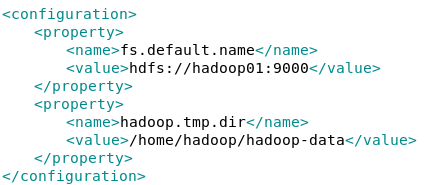

5. home/hadoop/hadoop-1.2.1/conf에서 hdfs-site.xml을 gedit로 열기 (hdfs 분산모드)

   property 추가

   

6. home/hadoop/hadoop-1.2.1/conf에서 mapred-site.xml gedit으로 열기

   property 추가

   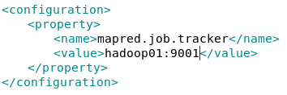

7. scp /home/hadoop/hadoop-1.2.1/conf/* hadoop@hadoop02:/home/hadoop/hadoop-1.2.1/conf/ 명령어로 복사해준 뒤 

   /home/hadoop/hadoop-1.2.1/bin/hadoop namenode -format로 namenode를 초기화 해준다

8. /home/hadoop/hadoop-1.2.1/bin/start-all.sh 하둡 실행명령어

9. jps : 역할이 무엇인지 출력하는 명령어

hadoop이 start되면 logs폴더 생김 => 기록 내용이 등록됨

## 2/14

/home/hadoop/hadoop-1.2.1/bin/hadoop fs -ls /input : 확인

/home/hadoop/hadoop-1.2.1/bin/hadoop fs -rmr /input : 제거

/home/hadoop/hadoop-1.2.1/bin/hadoop fs -mkdir /input : 생성

/home/hadoop/hadoop-1.2.1/bin/hadoop fs -copyFromLocal README.txt /input : 카피

jar 실행 명령어 jar파일

jar파일 안에 있는 wordcount class 파일 실행                                            /output 결과 저장

/bin/hadoop jar hadoop-examples-1.2.1.jar wordcount /input/README.txt /output

---

실습

haddop-examples-1.2.1.jar의 wordcount를 이용해서 작업하기

- HDFS에 myinput폴더를 작성한다.
- LICENSE.txt를 복사한다.
- wordcount를 적용
- 출력결과는 myoutput으로 작성

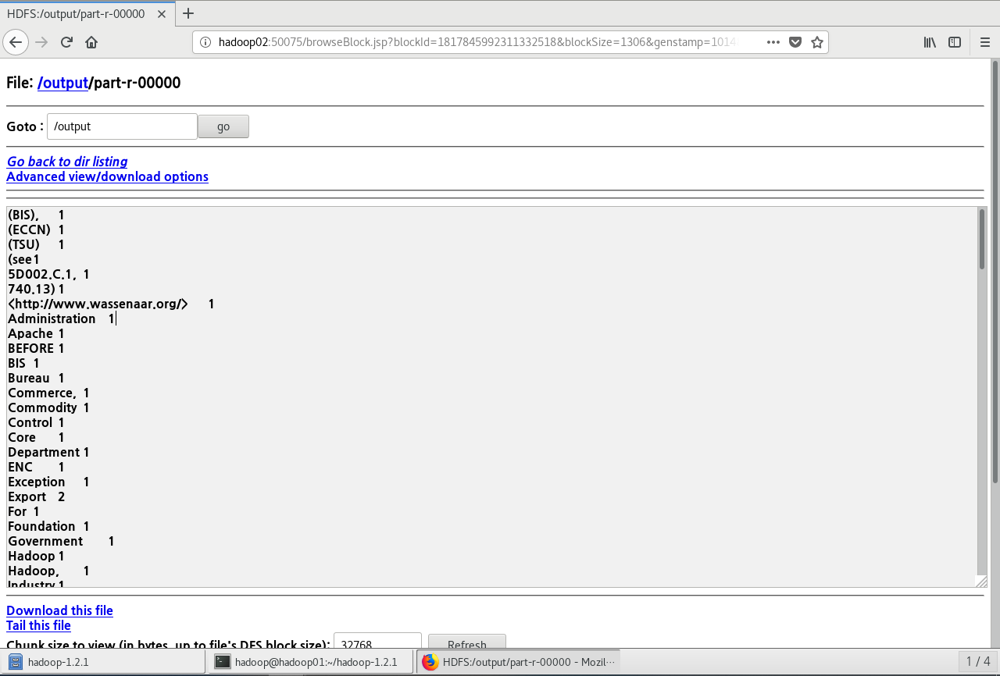

## 2/17

ip 바꼈을 때

- /etc/hosts 파일 변경

- scp 모든 copy

- 네트워크 프로세스 restart(모든 머신에 작업)

데이터 수집

- IOT, log - flume, RDBMS - sqoop, 웹페이지 - R, 크롤링 - R, SNS - R

데이터 저장

- HDFS, no-SQL

데이터 처리

- MapReduce -R

데이터 분석 / 분석결과활용

----

STS workspace 설정

UTF-8로 변경

tern 설치

Data Tool설치

---

fs => HDFS를 제어하는 명령어

빈도수 체크

---

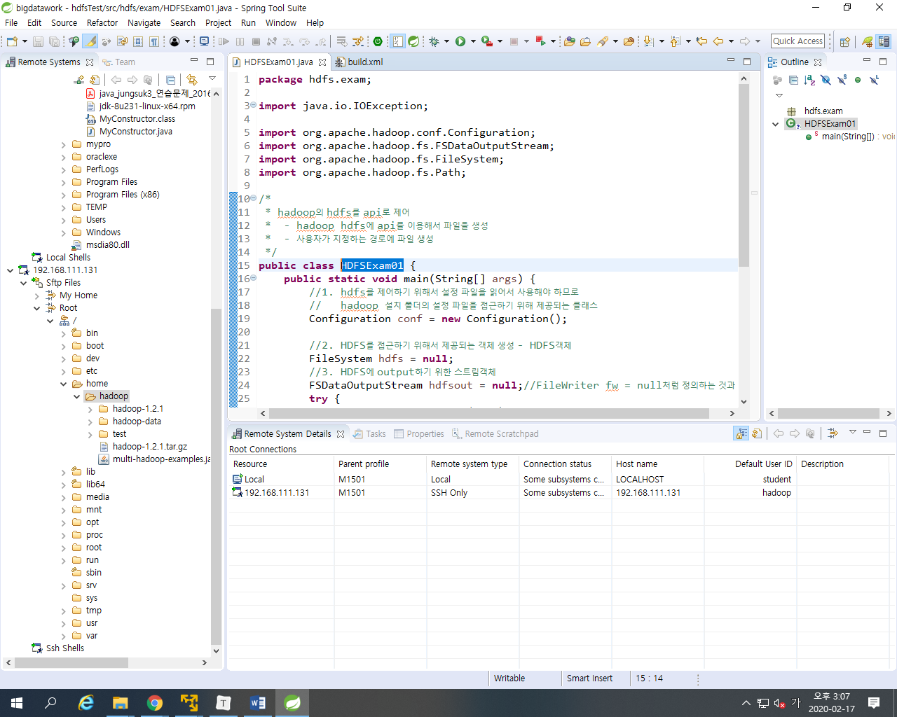

만든 파일을 hadoop에서 실행

./hadoop-1.2.1/bin/hadoop jar 자르파일 실행 명령어

output.txt에 hellohadoop을 써준다

./hadoop-1.2.1/bin/hadoop jar multi-hadoop-examples.jar hdfs.exam.HDFSExam01 output.txt hellohadoop

변경사항이 생기면 저장 > build.xml 실행 후에 jar파일을 다시 덮어쓰기 해주어야 한다.

output.txt 읽어오기

## 2/19

HDFSCopyTest

	- hdfs의 파일을 읽어서 새로운 파일을 생성
	- input파일경로, output파일경로를 명령행매개변수로
	- 클래스파일

실행시

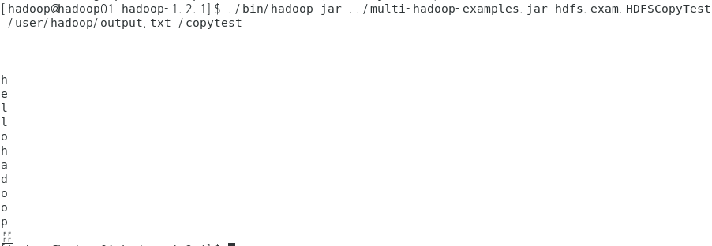

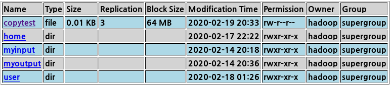

---

ls -a => 숨김파일까지 출력

ls -l => 목록 자세히 보기

ls *.conf => .conf인것 출력

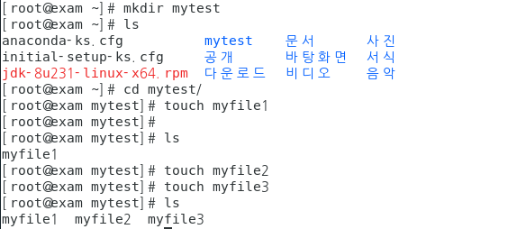

폴더 생성 파일 생성

scp 원격 복사 / cp 로컬에서 사용

cp myfile1(복사할 대상) myfileTest1(복사된 파일명)

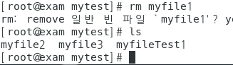

제거 명령어 rm

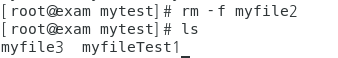

삭제할지 안 묻고 바로 제거

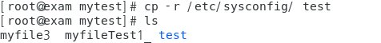

폴더 복사 cp

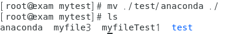

파일 이동 mv

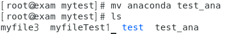

파일명 변경도 가능 mv

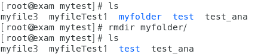

디렉토리 삭제

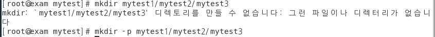

계층형 디렉토리 생성

계층형 디렉토리 삭제시

root 홈디렉토리 hadooptest폴더 생성

- /etc/sysconfig폴더 copy하기

- /root/의 anaconda-ks.cfg파일 복사하기

- 복사한 후 my_conda.cfg로 rename

- 아래의 구조를 갖고 있는 서브 디렉토리 생성하기

- mytest1

  ​		+

  ​		|ㅡㅡㅡ/etc/hosts파일복사

  ​		|ㅡㅡㅡmytest2

  ​							+

  ​							|

  ​							|___mytest3

  

cat my_conda.cfg 전체 내용 보기

head my_conda.cfg 위에서 10줄 보기

head -5 my_conda.cfg 위에서 5줄 보기

tail my_conda.cfg 아래서 10줄 보기

tail -5 my_conda.cfg 밑에서 5줄 보기

more my_conda.cfg 페이지 단위로 끈어서 보기

mpareduce

sts

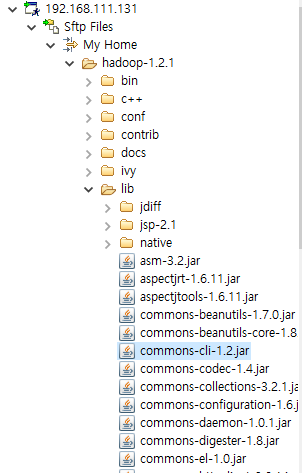

commons-cli-1.2.jar 복사해서 Local iot>setup>bigdata>lib에 붙여넣기

## 2/20

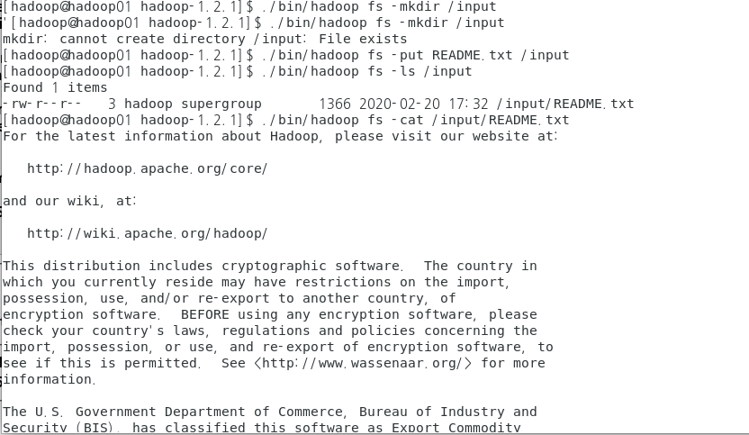

input 만들고 README.txt를 집어 넣는 작업

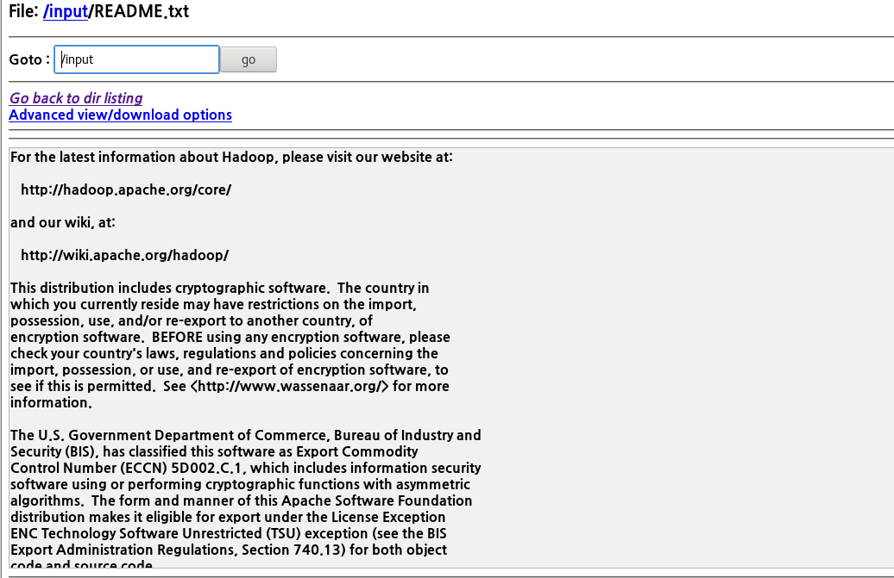

확인 결과

실행전

실행

실행 확인

sts mapreduce 작업 후에

바꿔준 후 

실행

----

mapred.exam01 

=> mapred.basic과 동일한 작업을 수행 5글자이상인 문자열만 빈도수 구하기

=> /input/README.txt파일을 이용

=> output

​			/mywork/wordcount_exam

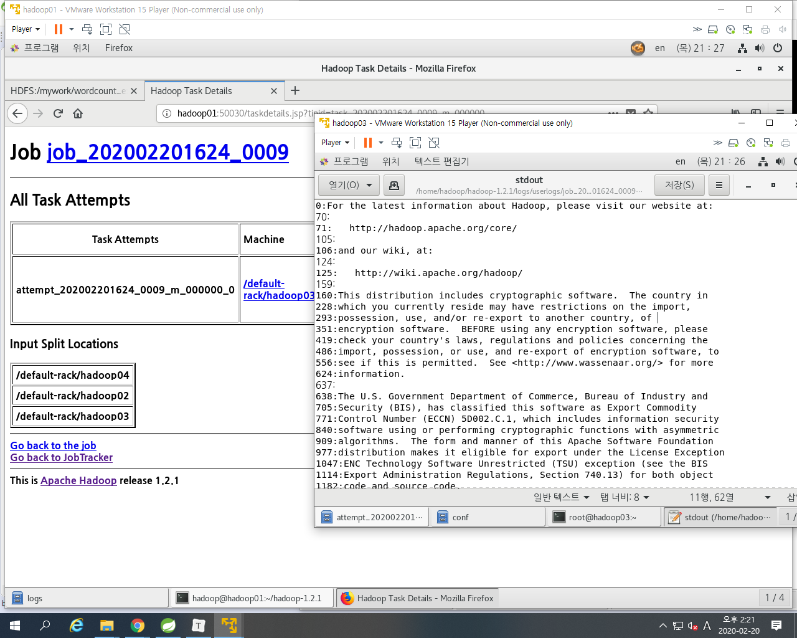

실행하고 log가서 확인하는 화면

## 2/21

mapred.exam.stock.option

- 상승마감
- 하락마감
- 동일금액마감

## 2/24

ip자동할당하지 않고 고정으로 셋팅하기

etc/sysconfig/network-scripts/ifcfg-ens33

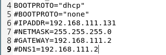

클러스터링해서 내부에서는 hadoop01을 인식하지만 외부에서는 그렇지 못함

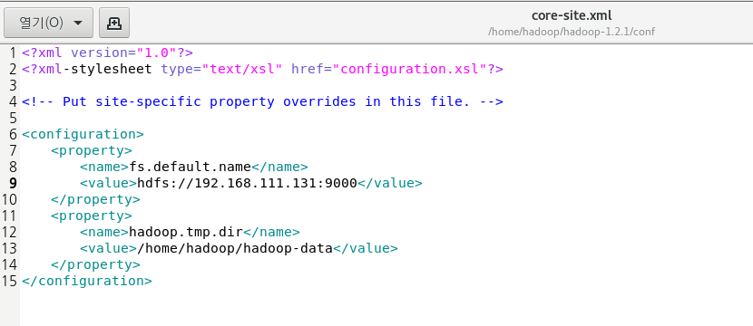

9번 라인을 hadoop01에서 ip로 변경

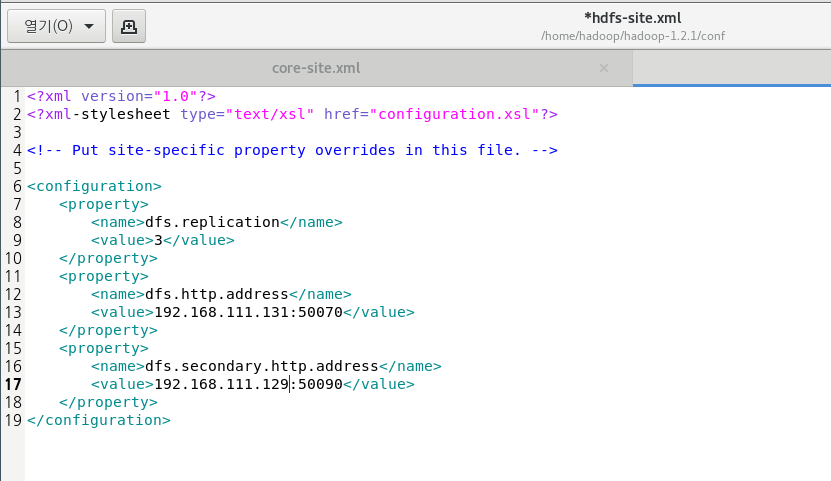

마찬가지로 13, 17번 라인 hadoop01,hadoop02를 해다 ip로 변경

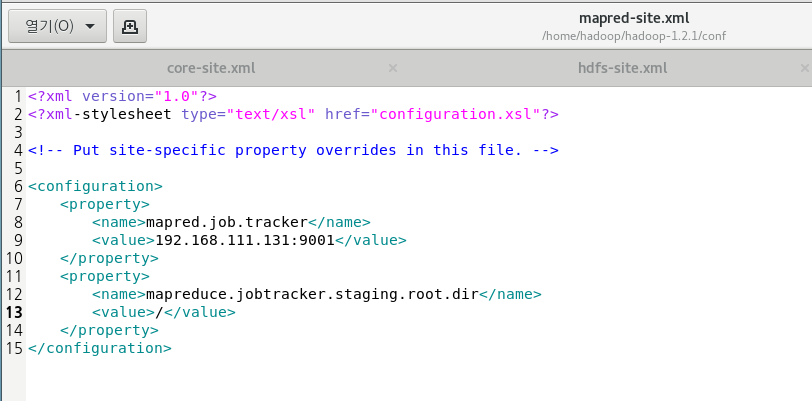

9번 라인 ip로 변경하고 13번라인에 접근 권한 범위를 지정가능 ex) /input or /user

---

sts에서 실행

프로젝트 생성 후 lib, conf폴더생성 후 hadoop01에 있는 lib에 있는 파일 .txt 두개 빼고 전부 복사, conf는 core,hdfs,mapred 세개 복사

그 후 build path에서 lib add, conf는 class로 add

string_prompt 추가

19~23번 라인 추가

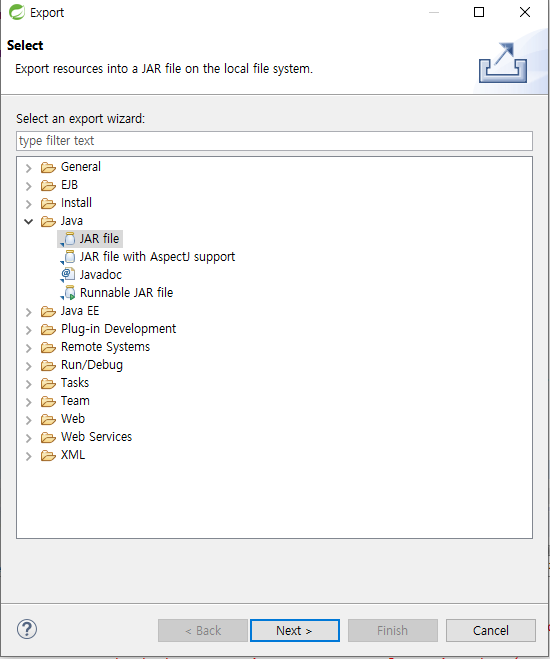

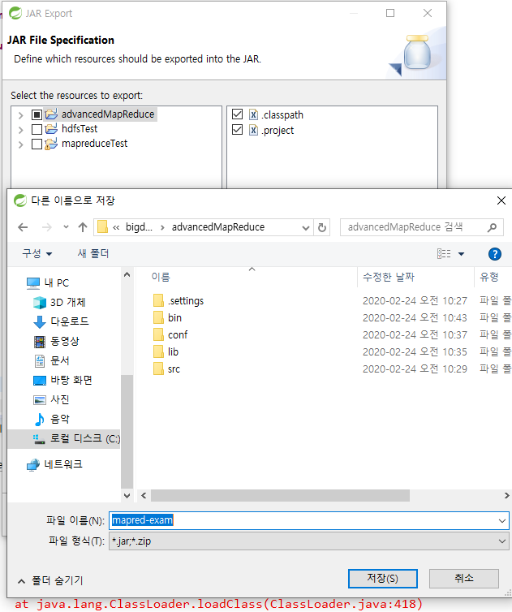

생기면 우클릭 build-path add

실행하면 똑같이 결과 나옴

spring에서 수정시 적용하려면 다시 export후에 위과정 반복해서 실행시켜야함

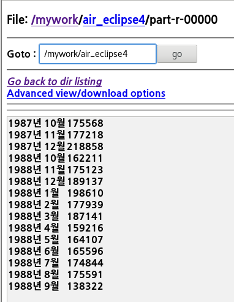

수정 후 년도 추가 후 실행 결과

-----

미션

IpCheck -> ip 타입으로 적절한지 체크

password체크 -> 8글자이상, 대문자, 소문자, 특수문자, 숫자가 모두 포함

pattern연습하면서 작업했던 코드 rename

## 3/9

air로 시작하는 것들 다 지워주고 air생성 후 .csv파일들을 넣어주는 과정

-----

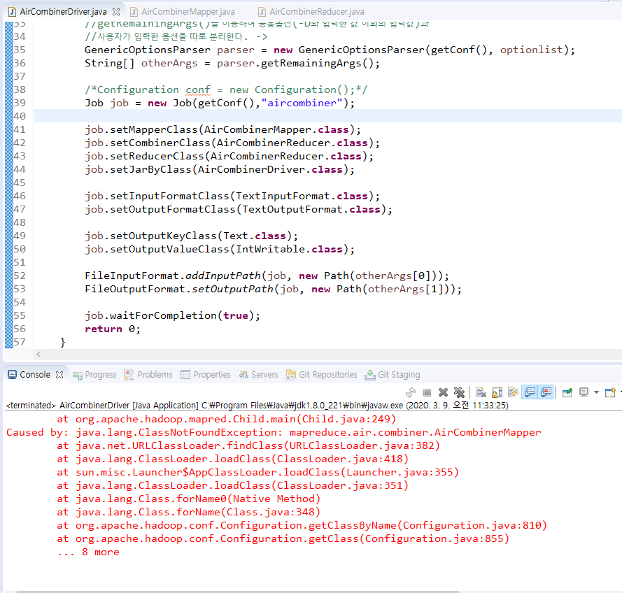

실행시 classnotfoundexception이 발생하는데 jar를 다시 등록안해주었기 때문

프로젝트 우클릭해서 export를 해주면

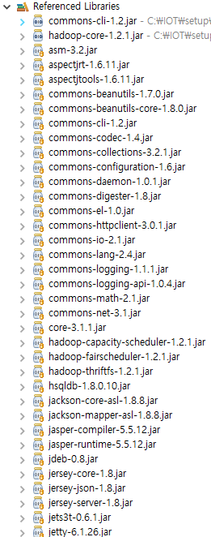

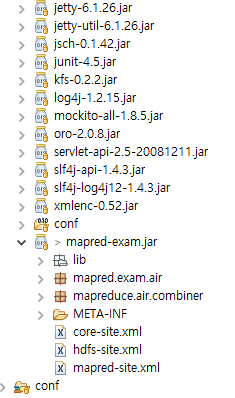

mapreduce.air.combiner가 생성됨

오라클 rownum

그냥 정렬시 231로 where절 우선실행 되므로 따라서 두번째처럼 사용

## 3/11

apache sqoop

링크주소 복사 후 

실행

압축 풀기

## 3/12

설정파일

etc 설정파일은 일반계정에서 건드리면 안됨

숨김파일

로그인시 활성화

export 부분 추가

저장후 적용

하둡에서 sql 실행

복사 후

붙여넣기

sqoop eval -connect jdbc:oracle:thin:@70.12.115.71:1521:xe -username shop -password shop -query "select * from tb_product" 실행

오라클 데이터 조회해서 결과를 하둡 hdfs에 보내기

결과확인

맵 테스크 2개 사용

반대로 hdfs에 있는 것을 sql로 가져오기

테이블 생성

import사용

/mywork/sqoop/ 데이터 넣기

---

---

조건을 주어서 가져오기

$인식 못하므로 \앞에 붙여준다

## 3/13

로그 확인

-----------------

apache flume

http://flume.apache.org/

### Flume

- 데이터를 추출하기 위해 사용되는 프로그램
- 시스템로그, 웹 서버의 로그, 클릭로그, 보안로그... 비정형데이터를 HDFS에 적재하기 위해 사용하는 프로그램
- 대규모의 로그데이터가 발생하면 효율적으로 수집하고 저장하기위해 관리
- flume, chukwa, scribe, fluented, splunk

[설정]

1. 다운로드(압축풀기)
2. .bashrc에 설정 정보 등록
3. flume-env.sh rename하고 정보등록
   - jdk홈디렉토리
   - hadoop홈디렉토리
4. flume 설정 파일에 등록
   - flume-conf.properties.teplate을 rename해서 XXXX.properties
   - flume agent의 source, channel, sink에 대한 정보를 등록

[Flume의 구성요소]

flume의 실행 중인 프로세스를 agent라 부르며 source, channel, sink로 구성

1. source

   - 데이터가 유입되는 지정(어떤 방식으로 데이터가 유입되는지 type으로 명시)
   - agent명.sources.source명.type=값

   1) type

   - netcat : telnet을 통해서 터미널로 들어오는 입력데이터

     (bind : 접속IP, port : 접속할 port)

   - spoolDir : 특정 폴더에 저장된 파일

     (spoolDir : 폴더명)

2. channel

- 데이터를 보관하는 곳(source와 sink사이의 Queue)

3. sink

   - 데이터를 내보내는 곳(어떤 방식으로 내보낼지 정의)

   1) type

   - logger : flume서버 콘솔에 출력이 전달

     flume을 실행할때 -Dfluem.root.logger=INFO,console를 추가

   - file_roll : file을 읽어서 가져오는 경우

     (directory : 읽어온 파일을 저장할 output폴더를 명시)

[flume의 실행]

[hadoop@hadoop01 apache-flume-1.6.0-bin]$ ./bin/flume-ng agent --conf conf --conf-file ./conf/console.properties --name myConsole -Dflume.root.logger=INFO,console

실행명령어 : ./bin/flume-ng agent

옵션

- --conf : 설정파일이 저장된 폴더명(-c)
- --conf-file : 설정파일명(-f)
- --name : agent의 이름(-n)
- -Dflume.root.logger=INFO,console : flume의 로그창에 기록

설치

wget으로 설치

압축풀기

15, 16줄 추가

telnet 설치

sqoop 실행상태에서 터미널 하나 더 열어서 telnet

telnet 종료

hdfs에 올리기

작성후

실행

파일을 input 폴더에 넣어주면 hdfs에 나타난다

## 3/14

hadoop02에서 아파치톰캣 다운

압축해제

설정파일 등록

네트워크 상태 확인

tomcat start

실행 후 네트워크 확인

127.0.0.1:8080으로 접속이 된다

두줄 등록

확인시 

접속가능해진다

외부프로그램으로 접속시 안된다

커서두줄 주석처리하면 접속됨

배포과정

실제 주소로 변경

export war file

배치를 눌러주면

배포가 되면 bigdatashop에 접속이 가능해진다

------

mission

1. 3번에 WAS를 구축
2. WAS에 bigdatashop을 배포
3. 3번에 flume을 설치
4. tomcat의 access log를 hdfs에 저장
   - avro 통신
   - hdfs -> /flume/tomcatlog
5. 메일로 제출
   - 3번의 WAS manager화면에 배포된 목록 캡쳐
   - hdfs에 저장된 access log 캡쳐
   - 각 머신의 flume설정파일

[테스트]

하둡머신의 flume실행

WAS머신의 flume실행

flume_input폴더에 로그파일 copy

-----

## 3/16 - MongoDB

MongoDB

- nosql
- 비정형데이터(스키마가 없다)
- json
- join 안됨

설치

path에 추가해주기

C:\Program Files\MongoDB\Server\3.6\bin

경로 설정해서 실행

서버가 실행된 화면

cmd창 하나 더 열어서 mongo

해주면

server cmd에서

연결 확인가능

해줘도 위와같이 연결 뜸

<<용어>>

- collection : 테이블
- document : 레코드
- field : 컬럼
- _id : 기본키

1. collection(rdbms에서 테이블)

   => 관계형 데이터베이스 처럼 스키마를 정의하지 않는다.

   1) 종류

   - capped collection

     고정 사이즈 주고 생성하는 컬렉션

     미리 지정한 저장공간이 모두 사용이 되면 맨 처음에 저장된 데이터가 삭제되고 공간으로 활용

   - non capped collection

     일반적인 컬렉션

   2) collection 관리

   [생성]

   db.createCollection("컬렉션명") -> 일반 collection

   db.createCollection("컬렉션명",{옵션list}) -> 각각의 옵션을 설정해서 작업(json)

   

   [삭제]

   db.collection명.drop()

   

   [컬렉션명 변경]

   db.컬렉션명.renameCollection("변경할컬렉션명");

   

   [실습]

   - mini 데이터베이스 생성
   - emp (size : 10000, capped컬렉션)
   - shop (일반컬렉션)
   - 데이터베이스 목록, 컬렉션 목록을 캡쳐
   - 컬렉션 validate() 화면캡쳐

2. mongodb에 insert

   [구문]

   db.컬렉션명.insert({데이터...})

   db.컬렉션명.insertOne({데이터...})

   db.컬렉션명.insertMany({데이터...})

   - document(관계형db에서 레코드개념)에 대한 정보는 json의 형식으로 작성

   - mongodb에서 document를 삽입하면 자동으로 _id가 생성 -> 기본키의 역할

     "_id" : ObjectId("5e6ee747d3bd9c758b5f3fef")

     ​                          ㅡㅡㅡㅡㅡㅡㅡㅡㅡㅡㅡㅡㅡㅡㅡ

     현재timestamp + machine Id + mongodb프로세스id + 순차번호(추가될때마다 증가)

3. mongodb에 update

   -> document 수정

   -> 조건을 적용해서 수정하기 위한 코드도 json으로 구현

   

   [update를 위한 명령어]

   $set : 해당필드의 값을 변경(업데이트를 하기 위한 명령어)

   ​		   none capped collection인 경우 업데이트할 필드가 없는 경우 추가한다.

   $inc : 해당필드에 저장된 숫자의 값을 증가

   #unset : 원하는 필드를 삭제할 수 있다.

   업데이트 옵션 : 

   ​			multi => true를 추가하지 않으면 조건에 만족하는 document 중 첫 번째 document만 update

   

   [구문]

   db.컬렉션명.update({조건필드:값},//sql의 update문 where절

   ​                                    {$set:{수정할필드:수정값}},//set절

   ​                                    {update와 관련된 옵션:옵션값})

   

   [실습]

   1. id가 kang사람의 dept를 "총무"로 변경
   2. dept가 "전산"인 모든 addr을 "안양"으로 변경
   3. id가 jang인 document의 bonus를 1000추가하기
   4. dept가 "인사"인 모든 document의 bonus에 2000을 추가하기

4. mongodb에서 배열 관리

   db.score.update({id:"jang"},

   ​							   {$set:

   ​                                   {info : 

   ​                                         {city : ["서울","안양"],

   ​                                           movie : ["겨울왕국2","극한직업","쉬리"]

   ​                                         }

   ​                                   }

   ​                               })

   

   $addToSet : 배열의 요소를 추가, 없는 경우에만 값을 추가, 중복을 체크

   db.score.update({id:"jang"},

   ​                                  {$addToSet : {"info.city":"인천"}})

   

   $push : 배열의 요소를 추가, 중복을 허용

   db.score.update({id:"jang},

   ​                                 {$push:{"info.city":"천안"}})

   

   $pop : 배열에서 요소를 제거할 때 사용

   1이면 마지막 요소를 제거, -1이면 첫 번째 요소를 제거

   db.score.update({id:"jang"},

   ​                                 {$pop:{"info.city":1}})

   db.score.update({id:"jang"},

   ​                                 {$pop:{"info.city":-1}})

   

   $each : addToSet이나 push에서 사용할 수 있다.

   ​             여러 개를 배열에 추가할 때 사용

   db.score.update({id:"jang"},

   ​                                   {$push:

   ​                                         {"info.city":

   ​                                                {$each:["천안","가평","군산"]}

   ​                                         }

   ​                                   })

   

   $sort : 정렬(1:오름차순, -1:내림차순)

   db.score.update({id:"jang"},

   ​                                   {$push:

   ​                                         {"info.city":

   ​                                                {$each:["천안","가평","군산"],

   ​                                                 $sort:1

   ​                                                }

   ​                                         }

   ​                                   })

   

   $pull : 배열에서 조건에 만족하는 요소를 제거(조건 한 개)

   db.score.update({id:"jang"},

   ​                                   {$pull:{"info.city":"천안"}})

   

   $pullAll : 배열에서 조건에 만족하는 요소를 제거(조건을 여러 개)

   db.score.update({id:"jang"},

   ​                                   {$pullAll:{"info.city":"가평","군산"}})
   
5. mongodb에 저장된 데이터 조회하기 - find()

   [실습1]

   score의 모든 document에 num필드(1000)가 추가되도록 작업 실행결과 보기

   

   

   1) find

   db.컬렉션명.find(조건, 조회할 필드에 대한 명시)

   - db.컬렉션명.find({})와 동일

   - 조건, 조회할 필드에 대한 명시 모두 json

   - 조회할 필드의 정보 명시

     형식 : {필드명:1...} : 화면에 표시하고 싶은 필드

     ​           {필드명:0} : 명시한 필드가 조회되지 않도록 처리

   [조건]

   $lt : <

   $gt : >

   $lte : <=

   $gte : >=

   

   $or - 여러 필드를 이용해서 같이 비교 가능

   $and - and 연산

   $in - 하나의 필드에서만 비교

   $nin - $in으로 정의한 조건을 제외한 document조회

   

   - addr이 인천인 데이터 : id, name, dept, addr

     db.score.find({addr:"인천"},{id:1,name:1,dept:1,addr:1,_id:0})

   - score 컬렉션에서 java가 90점 이상인 document조회

     id,name,dept,java만 출력

     db.score.find({java:{$gte:90}},{id:1,name:1,dept:1,java:1,_id:0})

   - dept가 인사이거나 addr이 인천인 데이터 조회

     db.score.find({$or:[{dept:"인사"},

     ​                                   {addr:"인천"}]})

   - id가 song, kang, hong인 데이터 조회

     db.score.find({$or:[{id:"song"},

     ​                                   {id:"hong"},

     ​                                   {id:"kang"}]})

     db.score.find({id:{$in:["song","hong","kang"]}})

   - id가 song, kang, hong이 아닌 데이터 조회

     db.score.find({id:{$nin:["song","hong","kang"]}})

   2) 조회메소드

   - findOne() : 첫 번째 document만 리턴

   - find() : 모든 document리턴

   - count() : 행의 갯수를 리턴

   - sort({필드명:sort옵션}) : 정렬

     1 => 오름차순

     -1 => 내림차순

   - limit(숫자) : 숫자만큼의 document만 조회

   - skip(숫자) : 숫자만큼의 document를 skip하고 조회

   3) 정규표현식을 적용

   db.컬렉션명.find({조건필드명:/정규표현식/옵션})

   [기호]

   | : or

   ^ : ^뒤에 문자로 시작하는지 체크

   [] : 영문자 하나는 한 글자를 의미하고 []로 묶으면 여러 글자를 표현

   ​	  [a-i] : a에서 i까지의 모든 영문자

   

   [옵션]

   i : 대소문자 구분없이 조회 가능

   - kim과 park인 document조회

     db.score.find({id:/kim|park/})

     

     db.score.find({id:/kim|park/i})

   - id가 k로 시작하는 document조회

     db.score.find({id:/^k/})

   - [a-i]까지 영문이 있는 id를 조회

     db.score.find({id:/[a-i]/})

   - id가 k-p로 시작하는 document조회

     db.score.find({id:/^[k-p]/})

   - id에 a와 i가 있는 document조회

     db.score.find({id:/[ai]/})

6. mongodb에 저장된 데이터 삭제하기 - remove()

   - 조건을 정의하는 방법은 find()나 update()와 동일

     db.score.remove({servlet:{$lt:80}})

7. Aggregation

   - group by와 동일개념

   - 간단한 집계를 구하는 경우 mapreduce를 적용하는 것 보다 간단하게 작업

   - Pipeline을 내부에서 구현

     한 연산의 결과가 또 다른 연산의 input데이터로 활용

     https://docs.mongodb.com/v3.6/core/aggregation-pipeline/의 그림 참고

   1) 명령어(RDBMS와 비교)

   $match : where절, having절

   $group : group by

   $sort : order by

   $avg : avg그룹함수

   $sum : sum그룹함수

   $max : max그룹함수

   

   [형식]

   db.컬렉션명.aggregate(aggregate명령어를 정의)

   ​                                       ㅡㅡㅡㅡㅡㅡㅡㅡㅡㅡㅡㅡ

   ​                                       여러 가지를 적용해야 하는 경우 배열

   $group:{_id:그룹으로 표시할 필드명, 

   ​                 연산결과를 저장할 필드명:{연산함수:값}}

   ​                                                                               ㅡㅡ

   ​                                                                               숫자나 필드참조

   $match:{필드명:{연산자:조건값}}

   ​                             ㅡㅡㅡㅡㅡㅡㅡ

   ​                            비교연산 or 조건이 여러 개

   - addr별 인원수

     db.exam.aggregate([

     ​                                       {$group:{_id:"$addr",

     ​                                                        num:{$sum:1}}

     ​                                       }

     ​                                   ])

     

     

   - dept별 인원수

     db.exam.aggregate([{$group:{_id:"$dept",num:{$sum:1}}}]);

   - dept별 java점수의 평균

     db.exam.aggregate([{$group:{_id:"$dept",avg:{$avg:"$java"}}}]);

   - addr별 servlet합계

     db.exam.aggregate([{$group:{_id:"$addr",sum:{$sum:"$servlet"}}}]);

   - dept별 java점수의 평균 단, addr이 인천인 데이터만 작업

     $match를 추가

     db.exam.aggregate([

     ​                                    {$match:{addr:"인천"}},

     ​                                    {$group:{_id:"$dept",

     ​                                                      평균:{$avg:"$java"}}

     ​                                    }])

사용(conn scott/tiger랑 비슷한 느낌)

상태확인

나오기

테이블 생성, 목록, show collections = 테이블 목록

정보 확인

옵션줘서 생성

테이블 삭제

이름 변경

capped 속성인지 확인

insert 후 상태 확인 find = 목록 조회

스키마가 없음 > 사이즈가 달라도 들어간다 컬럼2개 아래 3개 insert

data 등록, 확인

for문 사용

it 입력시 다 나옴

배열은 []로 관리 가능

_id가 존재하는 것을 insert시

수정문 true 옵션 없으면 처음 조건 만족하는 하나만 변경된다

옵션 추가시 전부 바낀다

inc사용하면 3000 > 5000으로 변경됨

원하는 필드 삭제

배열[],객체{}

addToSet

추가

push

계속 추가된다

each 사용

sort 사용 1

sort 사용 -1

push사용 천안인게 지워진다

조건 두개 pullAll 사용

내가한거

풀어주신거

-----------------

## 3/17

### MongoDB 이어서

{} : json object

[] : json array

json 데이터 하나로 펼쳐 보기

db.board.find().pretty()

x.num=120으로 추가 db.socre.find()시 추가된거 안나옴

db.score.save(x) 추가된다

전체 데이터 갯수 db.score.find().count();

num이 없는거 조회

5개만 조회 

db.score.find().limit(5);

5개 스킵

db.score.find().skip(5);

[실습]

**1. Score collection에서 이름과 주소와 servlet점수를 출력해보자**

**2. Score collection에서 java점수 중 70점 이상을 출력해보자**

**3. Score collection에서 이름, java점수를 출력하고 bonus가 2000이상**

**인 사람만 출력해보자**

**4. score에서 dept가 인사이면서 addr이 안양이거나 대구인 document 출력**

**5. servlet이 70에서 90사이이며 dept가 총무인 document 조회**

**6. score에서 이름에 김씨인 사람 조회해보기**

**7. score에서 servlet점수가 가장 낮은 document와 가장 높은 document 출력하기**

not, exists 사용

**8. java점수가 가장 높은 document중에 7개를 출력하되 2개를 건너뛰고 출력해보자**

**9. 아이디에 n과 o가 들어가는 document 구하기**

---

null 체크

[실습]

1. dept가 인사인 document의 servlet평균 구하기

   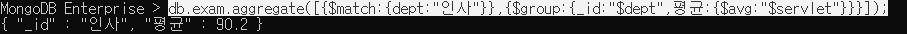

2. java가 80점이 넘는 사람들의 부서별로 몇 명인지 구하기

   

3. 2번 결과를 인원수데이터를 내림차순으로 정렬해 보세요.

   

-----

### STS - mongodb

pom.xml에서

버전 4.2.4로 변경

maven에서 mongodb 추가

mongo 체크하기

mongo 설정 추가

-------------

## 3/18

### mongodb import/export

사용한 명령어

export 명령어 사용해서 뽑아내는 과정

새 cmd 창

dir/w 목록 출력 명령어(ls랑 비슷)

mongoexport -d mydb -c score -o ./setup/score.json 처럼 경로 설정도 가능

-d db이름 -c 컬렉션

score.json이 생긴다

mongoimport --help

명령어 도움말

import 과정

iot폴더에 있는 test.csv를 import

/herderline은 첫줄은 헤더라서 제외시킨다는 명령어

들어간거 확인가능

-----

### STS - mongodb

위에서 MongoTemplate를 등록했기 때문에 위처럼 @Document 사용가능 컬렉셩명 명시

dto

servlet-context에 base-package 등록

---

r-project.org

왼쪽에 download

korea 찾아서 아무거나 클릭

rstudio.com

product > rstudio > rstudio desktop

----

## 3/19

R-project 설치시 경로에 한글이 포함되면 안된다. 띄어쓰기 없이 영문

기본으로 설치

R-project 실행 화면

R-studio 역시 경로에 띄어쓰기 없이 영문

관리자 권한으로 실행 자세히> 파일위치 열기

R은 한줄씩 실행 > 단축키 ctrl+enter

console창 clear > ctrl+l

? 명령어 실행하면 help에 설명이 나온다

ctrl+1 / ctrl+2 로 script창이랑 console창 변경가능

줄바꿈 체크

alt+- = <- 단축키

script끼리 변수를 공유한다.

## 3/20

R 패키지 추가

---

[데이터분석]

1. 데이터가져오기

   - 외부파일
   - 크롤링
   - DB(오라클,mongodb,hadoop,....)

   ==> R에서 사용할 수 있는 여러 형태의 데이터로 변환

   ​		변환된 데이터를 액세스

2. 데이터의 정보를 확인

   컬럼갯수, row갯수,  타입, 유형, 실제 저장된 데이터...