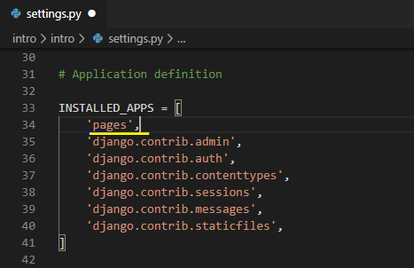
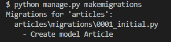
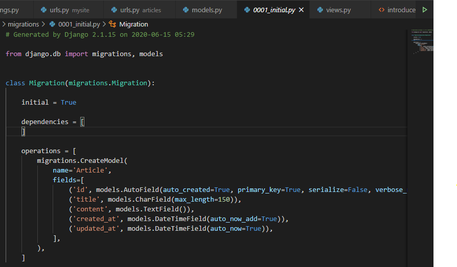
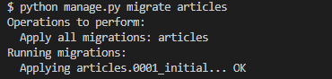
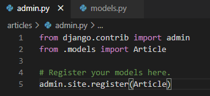

# Django intro

MTV : Model Template View

참고 사이트

https://docs.djangoproject.com/ko/3.0/intro/tutorial01/

https://developer.mozilla.org/ko/docs/Learn/Server-side/Django

## Start Django

1. 장고 설치

   ```bash
   $ pip install django==2.1.15
   $ pip list
   ```

2. 프로젝트 생성

   ```bash
   $ django-admin startproject <프로젝트 명>
   ```

   ```bash
   $ python manage.py runserver
   ```

3. 프로젝트 생성시 제공하는 파일

   - `manage.py`
     - 전체 django와 관련된 모든 명령어를 manage.py를 통해 실행 합니다.
   - `__init__.py`
     - 현재 `__init__.py`파일이 존재하는 폴더를 하나의 프로젝트, 혹은 패키지로 인식하게 해주는 파일
   - `settings.py`
     - 현재 프로젝트의 전체적인 설정 및 관리를 위해 존재하는 파일
   - `urls.py`
     - 내 프로젝트에 접근할 수 있는 경로를 설정하기 위한 파일
   - `wsgi.py`
     - 배포하기 위한 설정을 하는 파일

4. app 생성

   ```bash
   $ python manage.py startapp <앱 이름>
   ```

   앱 등록

   

   

----

# Django Project

------

## 프로젝트 생성

- **Project Name** : mysite
- **App Name** : articles

------

## 페이지 생성

1. **index page**
   - `/index/` : 전체 게시글 목록을 보여줄 페이지
2. **create pages **
   - `/new/` : 글 작성을 위한 form (제목, 내용) 입력 페이지
   - `/create/` : 글 작성 결과 (제목, 내용)를 출력하는 페이지

------

## 추가

1. **base template **
   - 모든 템플릿들이 상속 받을 base.html

------

## 주의사항

1. **urls.py** 설정 분리
   - app_name도 함께 설정
2. **template 폴더 구조**

-------

# Django ORM(DB 연동)

---

## CREATE

**1. INSERT INTO TABLE (column1, column2...) VALUES (values1, values2...)**

```python
# 첫번째 방법
article = Article()
article.title = 'first'
article.content = 'django!'
article.save()

# 두 번째 방법
# 어느 변수에 어떤 값을 넣을건지 명시
# id가 생략되어 있을 뿐, 자동으로 생성된다.
article = Article(title='second', content='django!')
article.save()

# 세 번째 방법
Article.objects.create(title='third', content='django!')
```

---

## READ

**2. SELECT * FROM articles_article**

```python
# 전체 조회
article = Article.objects.all()
```

**3. SELECT * FROM articles_article WHERE title='first'**

```python
# 특정 제목 불러오기
Article.objects.filter(title='first')
```

**SELECT * FROM articles_article WHERE title='first' LIMIT 1**

```python
Article.objects.filter(title='first').first()
Article.objects.filter(title='first').last()
Article.objects.filter(title='first')[0]
```

**SELECT * FROM articles_article WHERE id=1**

```python
Article.objects.get(id=1)
Article.objects.get(pk=1)
# 주의점
# 고유값이 아닌 내용을 필터링 해서
# 2개 이상의 값이 찾아지면 오류를 발생한다.
# 없는 것을 가지고 오려고 해도 오류 발생
```

**Like / startswith / endswith**

```python
# 특정 문자열을 포함 하고 있는가
Article.objects.filter(title__contains='fir')
# 특정 문자열로 시작 하는가
Article.objects.filter(title__startswith='SE')
# 특정 문자열로 끝나는가
Article.objects.filter(content__endswith='ha')
```

---

## UPDATE

**UPDATE articles_article SET title='byebye' WHERE id=1**

```python
# 수정
article = Article.objects.get(pk=1)
article.title = 'byebye'
article.save()
```

---

## DELETE

**DELETE FROM articles_article WHERE id=1**

```python
# 삭제
article = Article.objects.get(pk=1)
article.delete()
```

models.py 작성

```bash
from django.db import models

# Create your models here.
class Article(models.Model): 
    # articles_article
    title = models.CharField(max_length=150)
    content = models.TextField()
    created_at = models.DateTimeField(auto_now_add=True)
    updated_at = models.DateTimeField(auto_now=True)
```


bash 명령어

```bash
$ python manage.py makemigrations
```




생성 파일 확인




```bash
$ python manage.py migrate articles
```

버전 관리




파이선 shell 창 이동

```bash
$ python manage.py shell
Python 3.7.6 (tags/v3.7.6:43364a7ae0, Dec 19 2019, 00:42:30) [MSC v.1916 64 bit (AMD64)] on win32
Type "help", "copyright", "credits" or "license" for more information.
(InteractiveConsole)
>>> from articles.models import Article 
>>> Article.objects.all()
<QuerySet []>
```


```bash
<QuerySet []>
>>> article = Article()
>>> article.title = 'first'
>>> article.content = 'django!'
>>> article
<Article: Article object (None)>
>>> article.save()
>>> article
<Article: Article object (1)>
```


조회하기

```bash
>>> article = Article.objects.all()
>>> article
<QuerySet [<Article: Article object (1)>, <Article: Article object (2)>, <Article: Article object (3)>]>
>>> article[0].title
'first'
```


조회 내용

models.py

```bash
from django.db import models

# Create your models here.
class Article(models.Model): 
    # articles_article
    title = models.CharField(max_length=150)
    content = models.TextField()
    created_at = models.DateTimeField(auto_now_add=True)
    updated_at = models.DateTimeField(auto_now=True)

    def __str__(self):
        return f'{self.id}번째글 - {self.title} : {self.content}'
```


```bash
$ python manage.py shell
Python 3.7.6 (tags/v3.7.6:43364a7ae0, Dec 19 2019, 00:42:30) [MSC v.1916 64 bit (AMD64)] on win32
Type "help", "copyright", "credits" or "license" for more information.
(InteractiveConsole)
>>> from articles.models import Article
>>> Article.objects.all()
<QuerySet [<Article: 1번째글 - first : django!>, <Article: 2번째글 - second : django!>, <Article: 3번째글 - third : django!>]>
>>> 
```


admin에 모델 등록




super 계정 생성

```bash
$ python manage.py createsuperuser
사용자 이름 (leave blank to use 'student'): admin
이메일 주소: 
Password: 
Password (again):
비밀번호가 너무 일상적인 단어입니다.
Bypass password validation and create user anyway? [y/N]: y
Superuser created successfully.
```


admin 접속 가능


# django relation 1:N

---

## CREATE

```python
# 1. 댓글 생성
comment = Comment()
comment.content = '첫번째 댓글'
comment.save()

# 2. 게시글 하나 불러오기
article = Article.objects.get(pk=1)

# 2-1. comment와 article 연결하기
comment.article = article
comment.save()

# 또 다른 방법
# 작성하는 숫자는 article의 pk값
comment.article_id = 1 # article.pk
comment.save()
```

## READ

```python
# comment 변수들 불러오기
# 1. 댓글 pk 조회
comment.pk

# 2. 댓글 content 조회
comment.content

# 3. 댓글이 어느 게시글에 연결되어 있는가
comment.article_id

# 4. 댓글이 연결된 게시글
comment.article

# 4-1. 댓글이 연결된 게시글의 제목과 내용
comment.article.pk
comment.article.title
comment.article.content

# article의 경우는?
article.comment_set.all()
```


# Django ORM 조회

## 게시글 생성 ORM

```bash
user1 = User.objects.get(pk=1)
user1
Out[22]: <User: admin>

In [23]: article1 = Article.objects.create(title='title', content='content', user=user1)

In [24]: article1
Out[24]: <Article: 11번째 글, title-content>

Article.objects.create(title='title', content='content', user_id=user1.pk)
Out[26]: <Article: 12번째 글, title-content>
```

## 댓글 생성 ORM

```bash
In [27]: Comment.objects.create(content='content', user=user1, article=article1)
Out[27]: <Comment: Article:11번째 글, title-content, 23-content>
```

## 유저 생성 ORM

```bash
User.objects.create_user(username='name', password='password')
```


```bash
comment = Comment.objects.get()

comment.article.pk
4

comment.article.title
title

article = Article.objects.get(pk=4)


# article과 user의 입장에서 댓글과 게시글이 있는지 없는지 모르기때문에 set.all()로 가져온다.
article.comment_set.all()
user1.article_set.all()

# 반복문으로도 사용가능
for article in user1.article_set.all():
    print(article.title)


article1 = Article.objects.get(pk=?)
Comment.objects.create(content='content', user=user1, article=article1)
In [31]: user1.article_set.all()
Out[31]: <QuerySet [<Article: 1번째 글, 제목-내용`>, <Article: 4번째 글, 제목-내용>, <Article: 11번째 글, title-content>, <Article: 12번째 글, title-content>]>
```

- 1:N 관계에서 N의 입장은 항상 참조하는 관계가 존재하고 1을 보장할 수 있기 때문에 바로바로 접근가능
- 1의 입장에서는 접근하는 방법이 달라진다
  - `_set.all()` !!


## 1:N ORM

특정 게시글이 가지고 있는 전체 댓글 불러오기

```bash
article1 = Article.objects.get(pk=3)
In [36]: article1.comment_set.all()
Out[36]: <QuerySet [<Comment: Article:11번째 글, title-content, 23-content>]>
```

특정 댓글이 어느 게시글과 연결되어있는지 확인하기

```bash
In [37]: comment1 = Comment.objects.get(pk=1)

In [38]: comment1
Out[38]: <Comment: Article:1번째 글, 제목-내용`, 1-첫번째 댓글>

In [39]: comment1.pk
Out[39]: 1

In [40]: comment1.article
Out[40]: <Article: 1번째 글, 제목-내용`>

In [41]: comment1.article.title
Out[41]: '제목'
```

특정 게시글이 어느 유저와 연결되어있는지 확인하기

```bash
In [43]: article1.user
Out[43]: <User: admin>
```

특정 유저가 작성한 전체 게시글 가져오기

```bash
In [47]: user1 = User.objects.get(pk=1)

In [48]: user1.article_set.all()
Out[48]: <QuerySet [<Article: 1번째 글, 제목-내용`>, <Article: 4번째 글, 제목-내용>, <Article: 11번째 글, title-content>, <Article: 12번째 글, title-content>]>
```

특정 유저가 작성한 전체 댓글 가져오기

```bash
In [49]: user1 = User.objects.get(pk=1)

In [50]: user1.comment_set.all()
Out[50]: <QuerySet [<Comment: Article:1번째 글, 제목-내용`, 1-첫번째 댓글>, <Comment: Article:1번째 글, 제목-내용`, 3-ㄱㄱ>, <Comment: Article:1번째 글, 제목-내용`, 4-ㄷㄷ>, <Comment: Article:1번째 글, 제목-내용`, 7-ee>, <Comment: Article:1번째 글, 제목-내용`, 10-rr>, <Comment: Article:1번째 글, 제목-내용`, 16-ㄴㅇㄹㅇ>, <Comment: Article:11번째 글, title-content, 23-content>]>
```


----

```bash
In [1]: doctor = Doctor.objects.create(name='KIM')

In [2]: patient = Patient.objects.create(name='TOM')

In [3]: doctor
Out[3]: <Doctor: 1번 의사, KIM>

In [4]: patient
Out[4]: <Patient: 1번 환자, TOM>

In [5]: Reservation.objects.create(doctor=doctor, patient=patient)
Out[5]: <Reservation: 1번 의사, KIM의 1번 환자, TOM>

In [6]: doctor.reservation_set.all()
Out[6]: <QuerySet [<Reservation: 1번 의사, KIM의 1번 환자, TOM>]>

In [7]: patient.reservation_set.all()
Out[7]: <QuerySet [<Reservation: 1번 의사, KIM의 1번 환자, TOM>]>


In [9]: patient2 = Patient.objects.create(name='PARK')

In [10]: patient2
Out[10]: <Patient: 2번 환자, PARK>

In [11]: Reservation.objects.create(doctor=doctor, patient=patient2)
Out[11]: <Reservation: 1번 의사, KIM의 2번 환자, PARK>

In [12]: doctor.reservation_set.all()
Out[12]: <QuerySet [<Reservation: 1번 의사, KIM의 1번 환자, TOM>, <Reservation: 1번 의사, KIM의 2번 환자, PARK>]>

In [13]: for reservation in doctor.reservation_set.all():
    ...:     print(reservation.patient.name)
    ...: 
TOM
PARK

In [14]:  for reservation in doctor.reservation_set.all():
    ...:     ...:     print(reservation.patient.pk)
    ...: 
1
2

In [15]: for reservation in patient.reservation_set.all():
    ...:     print(reservation.doctor.name)
    ...: 
KIM
```


---

class Patient(models.Model):

  name = models.CharField(max_length=20)

  doctors = models.ManyToManyField(Doctor, through='Reservation')

```bash
In [1]: patient = Patient.objects.get(pk=1)

In [2]: patient.reservation_set.all()
Out[2]: <QuerySet [<Reservation: 1번 의사, KIM의 1번 환자, TOM>]>

In [3]: patient.doctors.all()
Out[3]: <QuerySet [<Doctor: 1번 의사, KIM>]>

In [4]: doctor = Doctor.objects.get(pk=1)

In [5]: doctor.reservation_set.all()
Out[5]: <QuerySet [<Reservation: 1번 의사, KIM의 1번 환자, TOM>, <Reservation: 1번 의사, KIM의 2번 환자, PARK>]>

In [6]: doctor.patient_set.all()
Out[6]: <QuerySet [<Patient: 1번 환자, TOM>, <Patient: 2번 환자, PARK>]>
```


related_name="patients"

```bash
In [1]: doctor = Doctor.objects.get(pk=1)

In [2]: doctor.patients.all()
Out[2]: <QuerySet [<Patient: 1번 환자, TOM>, <Patient: 2번 환자, PARK>]>
```


```python
class Doctor(models.Model):
    name = models.CharField(max_length=20)

    def __str__(self):
        return f'{self.pk}번 의사, {self.name}'

class Patient(models.Model):
    name = models.CharField(max_length=20)
    doctors = models.ManyToManyField(Doctor, related_name="patients")
    # through='Reservation', 
    def __str__(self):
        return f'{self.pk}번 환자, {self.name}'

# class Reservation(models.Model):
#     doctor = models.ForeignKey(Doctor, on_delete=models.CASCADE)
#     patient = models.ForeignKey(Patient, on_delete=models.CASCADE)

#     def __str__(self):
#         return f'{self.doctor}의 {self.patient}'
```

후에 db 지우고 다시 하면

```bash
In [1]: doctor = Doctor.objects.create(name="KIM")

In [2]: patient = Patient.objects.create(name="TOM")

In [3]: doctor.patients.add(patient)

In [4]: doctor.patients.all()
Out[4]: <QuerySet [<Patient: 1번 환자, TOM>]>

In [5]: doctor.patients.remove(patient)

In [6]: doctor.patients.all()
Out[6]: <QuerySet []>
```


settings.AUTH_USER_MODEL은 models.py에서만 사용하고

다른 곳에서는 get_user_model() 사용