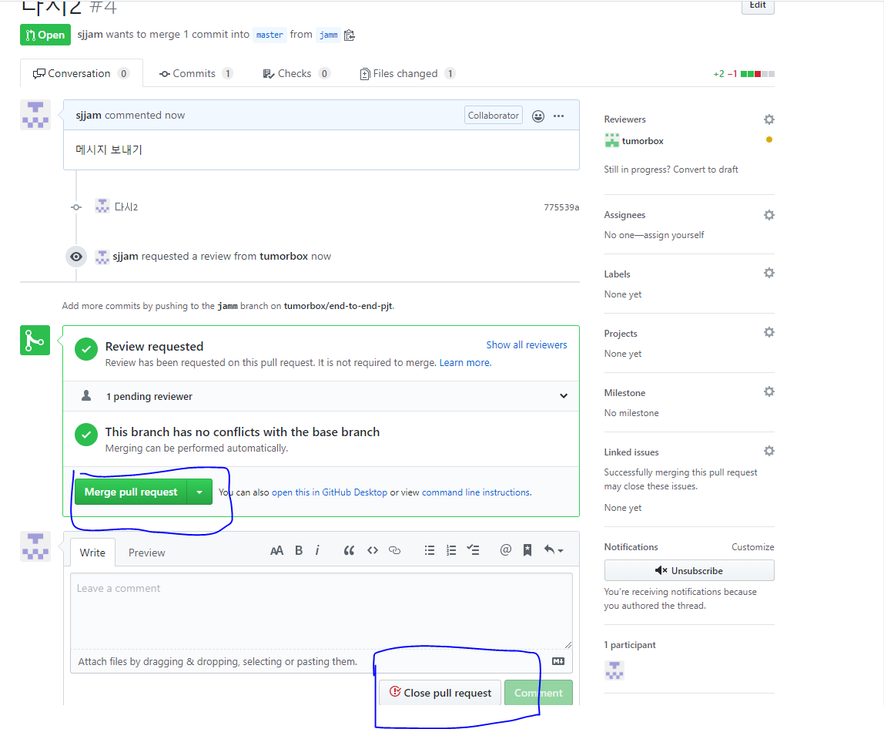

# Git 특강 4/23

## 참고 git 사이트

- 수업정리!!!!!
  - https://github.com/edutak/bigiot-a
- git 정리 구글 드라이브
  - https://drive.google.com/file/d/1bkvYHMN2Rz8b0GZNw7GY5-flTOKF8pZj/view
- git 참고 사이트
  - https://backlog.com/git-tutorial/kr/stepup/stepup7_2.html

- 개발자 기술 면접
  - https://github.com/JaeYeopHan/Interview_Question_for_Beginner
- 주니어 개발자 채용 정보
  - https://github.com/jojoldu/junior-recruit-scheduler
- 원격 근무 회사
  - https://github.com/milooy/remote-or-flexible-work-company-in-korea
- .gitignore 파일 생성 사이트
  - http://gitignore.io/
- emoji 사이트
  - https://emojipedia.org/
- 마크다운 이모지
  - https://gist.github.com/rxaviers/7360908
- vim 연습 게임
  - https://vim-adventures.com/
- 좋은 git commit 메시지를 위한 영어 사전
  - https://blog.ull.im/engineering/2019/03/10/logs-on-git.html
- 백엔드 개발자를 꿈꾸는 학생개발자에게
  - https://d2.naver.com/news/3435170
- 좋은 git 커밋 메시지를 작성하기 위한 7가지 약속
  - https://meetup.toast.com/posts/106
- 노션앱(notion)
- github student pack
  - https://education.github.com/pack
- 아이콘 
  - https://fontawesome.com/
- bootstrap 레쥬메
  - https://startbootstrap.com/themes/resume/
- git 책
  - https://git-scm.com/book/ko/v2

## Git

- DVCS (분상형 버전 관리 시스템)

- 개발 : 리누스 토르발스

- 중요 명령어 : git status

  배쉬화면 CLI(command line interface)

  window화면 GUI(graphic user interface)

[](https://github.com/sjjam/TIL/blob/master/git 특강/Git 특강 423.md)

- 구조

  - working directory

    |add

  - staging area

    |commit

  - commits

  [](https://github.com/sjjam/TIL/blob/master/git 특강/Git 특강 423.md)

  세 개 모두 비어있음을 의미

## Git status를 통해 정리하기

### CLI 기초 명령어

```bash
# list (파일 목록)
$ ls
# change directory(디렉토리 변경)
$ cd
# 빈 파일 생성
$ touch <파일명>
```

### 상황

#### 1. add

```bash
$ touch a.txt
$ git status

No commits yet
# 트래킹X. 새로 생성된 파일.
Untracked files:
  # 커밋을 하기 위한 곳에 포함시키려면
  # Staging area로 이동시키려면, git add
  (use "git add <file>..." to include in what will be committed)
        a.txt
# WD O, Staging area X
nothing added to commit but untracked files present (use "git add" to track)
$ git add a.txt
$ git status
On branch master

No commits yet
# 커밋될 변경사항들(staging area O)
Changes to be committed:
  # unstage를 위해서 활용할 명령어(add 취소)
  (use "git rm --cached <file>..." to unstage)
        new file:   a.txt
```

#### 2. commit

```bash
$ git commit -m 'Create a.txt'
[master (root-commit) 376d250] Create a.txt
 1 file changed, 0 insertions(+), 0 deletions(-)
 create mode 100644 a.txt

$ git status
On branch master
nothing to commit, working tree clean
```

- 커밋 내역 확인

```bash
$ git log
commit 376d25047ba5305a87f8d3fae794210a39d8e839 (HEAD -> master)
Author: sjjam <shimjm21@gmail.com>
Date:   Thu Apr 23 10:34:14 2020 +0900

    Create a.txt
    
$ git log --oneline
376d250 (HEAD -> master) Create a.txt
```

#### 3. 추가파일 변경 상태

```bash
$ touch b.txt
$ git status
On branch master
Changes not staged for commit:
  (use "git add <file>..." to update what will be committed)
  (use "git restore <file>..." to discard changes in working directory)
        modified:   a.txt

Untracked files:
  (use "git add <file>..." to include in what will be committed)
        b.txt

no changes added to commit (use "git add" and/or "git commit -a")
$ git add a.txt
$ git status
On branch master
Changes to be committed:
  (use "git restore --staged <file>..." to unstage)
        modified:   a.txt

Untracked files:
  (use "git add <file>..." to include in what will be committed)
        b.txt
```

#### 4. 커밋 메시지 변경

> **주의!!** 커밋 메시지 변경시 해시값 자체가 변경되어,
>
> 이미 원격저장소에 push 한 이력에 대해선느 메시지
>
> 변경을 하면 안된다.

```bash
$ git commit --amend
```

- vim 텍스트 편집기가 실행된다.

  - `i`: 편집 모드

  - ```bash
    esc
    ```

     

    편집 모드를 종료하고, 명령 모드에서

    - :wq
      - write + quit

```bash
[master f260885] a.txt 추가
 Date: Thu Apr 23 10:45:10 2020 +0900
 1 file changed, 22 insertions(+), 1 deletion(-)
```

##### 4-1. 특정 파일을 빼놓고 커밋 했을 때

```bash
$ git add <omit_file>
$ git commit --amend
```

- 빠뜨린 파일을 add 한 이후에 commit --amend를 하면, 해당 파일까지 포함하여 재커밋이 이뤄진다.

#### 5. 작업 내용을 이전 버전으로 되돌리기

- a.k.a. 작업 하던 내용 버리기

```bash
$ git status
On branch master
Changes not staged for commit:
  (use "git add <file>..." to update what will be committed)
  # WD 변경사항들을 버리기 위해서는 restore
  (use "git restore <file>..." to discard changes in working directory)
        modified:   a.txt

no changes added to commit (use "git add" and/or "git commit -a")

$ git restore a.txt
$ git status
On branch master
nothing to commit, working tree clean
```

#### 6. 특정 파일/폴더 삭제 커밋

> 해당 명령어는 실제 파일이 삭제되는 것은 아니지만, git에서 삭제되었다는 이력을 남기는 것

```bash
$ git rm --cached b.txt
Changes to be committed:
  (use "git restore --staged <file>..." to unstage)
        deleted:    b.txt

Untracked files:
  (use "git add <file>..." to include in what will be committed)
        b.txt

# 주의!! 해당 파일이 물리적으로 삭제 되는 것은 아니다.
```

- 일반적으로는 .gitignore와 함께 활용한다.

  1. .gitignore 에 해당 파일 등록
  2. git rm --cached를 통해 삭제 커밋

  - 이렇게 작업을 하면, 실제 파일은 삭제되지 않지만 이후로 git으로 전혀 관리되지 않는다.

## gitignore

- git으로 관리하고 싶지 않는 파일을 등록하여 활용할 수 있다.
- 일반적으로 프로젝트 환경(IDE, OS 등)에 관련된 정보나 추가적으로 공개되면 안되는 데이터 파일 등을 설정한다.
- 일반 프로젝트 환경에 대한 정보는 우선 [gitignore.io](https://gitignore.io/)에서 프로젝트 시작할 때마다 정의하는 습관을 가지자.

```bash
# 특정 파일
secret.csv
# 특정 폴더
idea/
# 특정 확장자
*.csv
# 특정 폴더에서 특정 파일 빼고
!idea/a.txt
```


# Git branch

## 1. branch 관련 명령어

> Git 브랜치를 위해 root-commit을 발생시키고 진행하세요.

1. 브랜치 생성

   ```bash
   (master) $ git branch {브랜치명}
   ```

2. 브랜치 이동

   ```bash
   (master) $ git checkout {브랜치명}
   ```

3. 브랜치 생성 및 이동

   ```bash
   (master) $ git checkout -b {브랜치명}
   ```

4. 브랜치 삭제

   ```bash
   (master) $ git branch -d {브랜치명}
   ```

5. 브랜치 목록

   ```bash
   (master) $ git branch
   ```

6. 브랜치 병합

   ```bash
   (master) $ git merge {브랜치명}
   ```

   - master 브랜치에서 {브랜치명}을 병합

## 2. branch 병합 시나리오

> branch 관련된 명령어는 간단하다.
>
> 다양한 시나리오 속에서 어떤 상황인지 파악하고 자유롭게 활용할 수 있어야 한다.

### 상황 1. fast-foward

> fast-foward는 feature 브랜치 생성된 이후 master 브랜치에 변경 사항이 없는 상황

1. feature/test branch 생성 및 이동

   ```bash
   # 엔터 탭 backspace
   (master) $ git checkout -b feature/test
   Switched to a new branch 'feature/test'
   (feature/test) $
   ```

2. 작업 완료 후 commit

   ```bash
   $ touch test.txt
   $ git add .
   $ git commit -m 'Complete test'
   ```

3. master 이동

   ```bash
   (feature/test) $ git checkout master
   Switched to branch 'master'
   (master) $
   ```

4. master에 병합

   ```bash
   (master) $ git merge feature/test
   Updating a897640..4580910
   Fast-forward
    test.txt | 0
    1 file changed, 0 insertions(+), 0 deletions(-)
    create mode 100644 test.txt
   ```

5. 결과 -> fast-foward (단순히 HEAD를 이동)

   ```bash
   $ git log --oneline
   4580910 (HEAD -> master, feature/test) Complete test
   a897640 Complete menu
   65b6242 Init
   ```

6. branch 삭제

   ```bash
   $ git branch -d feature/test
   Deleted branch feature/test (was 4580910).
   ```

------

### 상황 2. merge commit

> 서로 다른 이력(commit)을 병합(merge)하는 과정에서 **다른 파일이 수정**되어 있는 상황
>
> git이 auto merging을 진행하고, **commit이 발생된다.**

1. feature/signout branch 생성 및 이동

   ```bash
   $ git checkout -b feature/signout
   ```

2. 작업 완료 후 commit

   ```bash
   $ touch signout.txt
   $ git add .
   $ git commit -m 'Complete Signout'
   ```

3. master 이동

   ```bash
   2dfe2d8 (HEAD -> feature/signout) Complete signout
   4580910 Complete test
   a897640 Complete menu
   65b6242 Init
   
   07c50a5 (HEAD -> master) Hotfix
   4580910 Complete test
   a897640 Complete menu
   65b6242 Init
   ```

4. *master에 추가 commit 이 발생시키기!!*

   - **다른 파일을 수정 혹은 생성하세요!**

   - ```bash
     $ touch hotfix.txt
     $ git add .
     $ git commit -m 'Hotfix'
     ```

5. master에 병합

   ```bash
   (master) $ git merge feature/signout
   Merge made by the 'recursive' strategy.
    signout.txt | 0
    1 file changed, 0 insertions(+), 0 deletions(-)
    create mode 100644 signout.txt
   ```

6. 결과 -> 자동으로 *merge commit 발생*

   - vim 편집기 화면이 나타납니다.

   - 자동으로 작성된 커밋 메시지를 확인하고, `esc`를 누른 후 `:wq`를 입력하여 저장 및 종료를 합니다.

     - `w` : write
     - `q` : quit

   - 커밋이 확인 해봅시다.

     ```bash
     $ git log --oneline
     3348e1f (HEAD -> master) Merge branch 'feature/signout'
     07c50a5 Hotfix
     2dfe2d8 (feature/signout) Complete signout
     4580910 Complete test
     a897640 Complete menu
     65b6242 Init
     ```

7. 그래프 확인하기

   ```bash
   $ git log --oneline --graph
   *   3348e1f (HEAD -> master) Merge branch 'feature/signout'
   |\
   | * 2dfe2d8 (feature/signout) Complete signout
   * | 07c50a5 Hotfix
   |/
   * 4580910 Complete test
   * a897640 Complete menu
   * 65b6242 Init
   ```

8. branch 삭제

   ```bash
   $ git branch -d feature/signout
   ```

------

### 상황 3. merge commit 충돌

> 서로 다른 이력(commit)을 병합(merge)하는 과정에서 **같은 파일의 동일한 부분이 수정**되어 있는 상황
>
> git이 auto merging을 하지 못하고, 충돌 메시지가 뜬다.
>
> 해당 파일의 위치에 표준형식에 따라 표시 해준다.
>
> 원하는 형태의 코드로 직접 수정을 하고 직접 commit을 발생 시켜야 한다.

1. feature/board branch 생성 및 이동

   ```bash
   $ git checkout -b feature/board
   ```

2. 작업 완료 후 commit

   ```bash
   $ touch board.txt
   # README.md 파일 수정
   $ git status
   On branch feature/board
   Changes not staged for commit:
     (use "git add <file>..." to update what will be committed)
     (use "git restore <file>..." to discard changes in working directory)
           modified:   README.md
   
   Untracked files:
     (use "git add <file>..." to include in what will be committed)
           board.txt
   $ git add .
   $ git commit -m 'Complete board & Update README'
   ```

3. master 이동

   ```bash
   $ git checkout master
   ```

4. *master에 추가 commit 이 발생시키기!!*

   - **동일 파일을 수정 혹은 생성하세요!**

   - ```bash
     # README 수정
     $ git add .
     $ git commit -m 'Update READEME'
     ```

5. master에 병합

   ```bash
   $ git merge feature/board
   Auto-merging README.md
   CONFLICT (content): Merge conflict in README.md
   Automatic merge failed; fix conflicts and then commit the result.
   
   (master|MERGING) $
   ```

6. 결과 -> *merge conflict발생*

   > git status 명령어로 충돌 파일을 확인할 수 있음.

   ```bash
   (master|MERGING) $ git status
   On branch master
   You have unmerged paths.
     (fix conflicts and run "git commit")
     (use "git merge --abort" to abort the merge)
   
   Changes to be committed:
           new file:   board.txt
   
   Unmerged paths:
     (use "git add <file>..." to mark resolution)
           both modified:   README.md
   ```

7. 충돌 확인 및 해결

   - 해당 파일 원하는대로 수정

     ```bash
     <<<<<< HEAD
     * 마스터 작업
     ============
     >>>>>>> feature/board
     ```

   - 수정 완료 후 add

     ```bash
     $ git add .
     ```

8. merge commit 진행

   ```bash
   $ git commit
   ```

   - vim 편집기 화면이 나타납니다.

   - 자동으로 작성된 커밋 메시지를 확인하고,

      

     ```bash
     esc
     ```

     를 누른 후

      

     ```bash
     :wq
     ```

     를 입력하여 저장 및 종료를 합니다.

     - `w` : write
     - `q` : quit

   - 커밋이 확인 해봅시다.

9. 그래프 확인하기

   ```bash
   $ git log --oneline --graph
   *   de31803 (HEAD -> master) Merge branch 'feature/board'
   |\
   | * 3e53676 (feature/board) Compelte board & update README.md
   * | d58153b Update README
   |/
   *   3348e1f Merge branch 'feature/signout'
   |\
   | * 2dfe2d8 Complete signout
   * | 07c50a5 Hotfix
   |/
   * 4580910 Complete test
   * a897640 Complete menu
   * 65b6242 Init
   ```

10. branch 삭제

    ```bash
    $ git branch -d feature/board
    ```

    

# Stash

> 작업 내역을 임시 저장 할 수 있음.

## 기본 명령어

```bash
# 1. stash 공간에 작업내역 저장
$ git stash
Saved working directory and index state WIP on master

# 2. stash list 보기
$ git stash list
stash@{0}: WIP on master: a8cd8e9 Init

# 3. 임시 공간 내용 가져오기
$ git stash pop
```

## 예시

- 로컬에서 작업하고 있던 중, `pull` 을 받아서 원격 저장소에 새로운 내용을 반영 해야 하는 경우

```bash
$ git pull origin master
From https://github.com/edutak/big-iot-1001
 * branch            master     -> FETCH_HEAD
error: Your local changes to the following files woule:
        README.md
# 1. 커밋하거나 => 버전으로 남겨도 되는 경우
# 2. stash => 작업 중일 때
Please commit your changes or stash them before you merge
Aborting
Updating a8cd8e9..00d69a4
```

- 해결 방법

  ```bash
  $ git stash
  $ git pull origin master
  From https://github.com/edutak/big-iot-1001
   * branch            master     -> FETCH_HEAD
  Updating a8cd8e9..00d69a4
  Fast-forward
   README.md | 112 ++++++++++++++++++++++++++++++++++++--
   1 file changed, 104 insertions(+), 8 deletions(-)
  # 만약 동일 파일 수정이 있으면, conflict를 발생시킨다.
  $ git stash pop
  Auto-merging README.md
  CONFLICT (content): Merge conflict in README.md
  The stash entry is kept in case you need it again.
  ```

# reset vs revert

## 1. reset

- 특정 버전으로 되돌아가는 작업

  ```
  $ git reset {커밋해시코드}
  ```

  - `reset` 명령어의 결과는 다음과 같다.

    ```bash
    $ git log --oneline
    275a7e2 ddd
    00d69a4 (origin/master) Update README.md
    $ git reset 00d69a4
    $ git log --oneline
    00d69a4 (origin/master) Update README.md
    ```

  - `reset` 옵션

    - 기본 : 이전 이력의 변경 사항을 WD에 보관
    - `--hard` : 이전 이력의 변경 사항은 모두 삭제. **주의**

## 2. revert

- 특정 시점을 되돌렸다는 커밋을 발생 시킴.

  ```bash
  $ git log --oneline
  275a7e2 ddd
  00d69a4 (origin/master) Update README.md
  $ git revert 275a7e2
  $ git log --oneline
  bca6426 (HEAD -> master) Revert "ddd"
  275a7e2 ddd
  00d69a4 (origin/master) Update README.md
  ```


# Git 특강 4/24 내 필기

집상황


클론으로 가져오면 폴더가 생김

그 후는 생긴 폴더로 들어가서 작업


멀캠상황

와서 집에서 올린것을 pull 받음


다시 집 상황

와서 작업 후 다시 git에 올리는 작업 시 에러 발생


깃헙 이력과 내가 작업한 이력이 다르다.


pull 해주면 vim 화면(commit상황)


독립적 작업을 위해 Branch


## Branch

상태 확인


master


branch 생성


branch 이동


이력 확인


병합


병합 완료된 브랜치는 삭제한다.


브랜치 생성 후 바로 이동


---

충동 시 visual studio code


체크 클릭으로 상태에 따라 변경도 가능


collaborator로 초대 (push를 위해서)


add와 commit 동시 명령어


## pull requeset

1. branch를 만들어서 작업
2. git push origin {브랜치 이름}
3. PR
4. 상대방거 merge or close


브랜치를 생성 후 

파일 수정 후

push를 브랜치 이름으로


pull request 설정


reviewers와 Assignees 설정 가능



보내서 합칠지 취소할지 설정

그후 confirm merge 해주면 merge가 완료


## Fork

1. fork
2. clone (여러분들 저장소를)
3. 작업
4. push (여러분 저장소)
5. PR (저에게)


모르는 git 참여할시


clone fork 받으면 내꺼로 생긴  주소로


작업 중이다가 pull 받는 경우

stash > 작업중인 파일을 임시 저장 공간에 저장