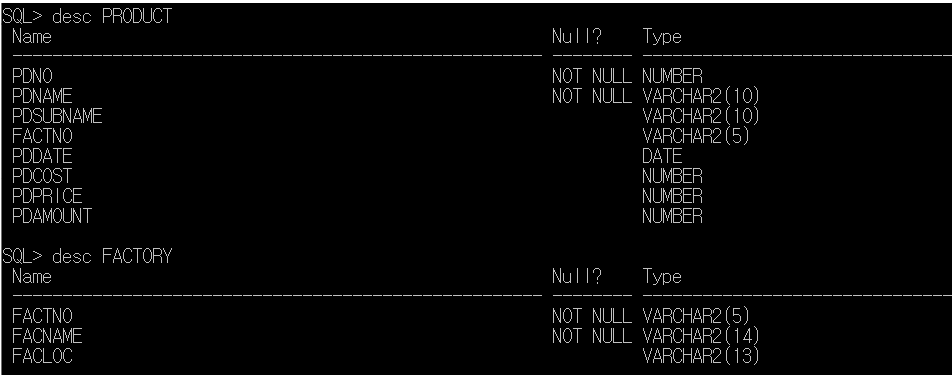
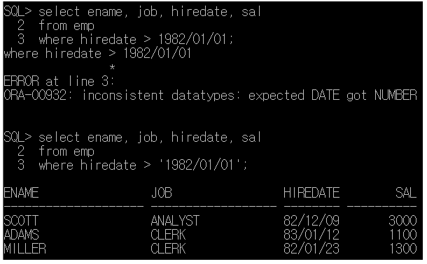
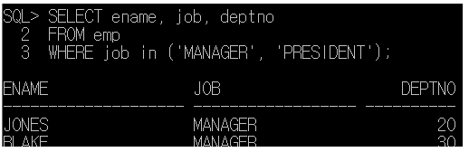
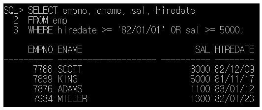
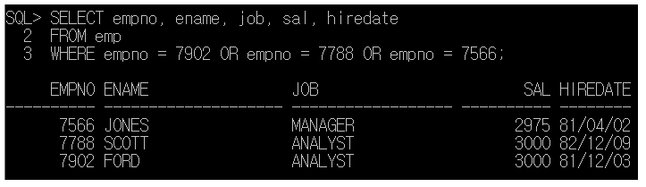

# < 1. Query >

1. 기본 select

select 컬럼명1, 컬럼명2, …

from 테이블

- SQL문을 대소문자 구분 (X)
- ';' : SQL문의 종료 > ';'을 입력하기 전에 여러 줄로 SQL문 작성 (O)
- '*' : 모든 컬럼을 조회
- 컬럼에 null 저장(O)

 \* null : 아무 값도 없는 것. 사용할 수 없고 정의되어 있지 않음.

  null != 0 / null != (스페이스)

- 컬럼명 대신 alias를 정의해서 사용 (O)

select 컬럼명 alias명, 컬럼명 AS alias명, 컬럼명 "alias명" > 공백이 있는 경우 "" 사용

- 여러 컬럼을 합쳐서 하나의 컬럼으로 조회 (O) > '|' 이용
- 오라클의 문자열, 날짜 데이터는 ' '로 표현
- 연산의 결과로 컬럼을 생성 (O)  > '+', '*', '/', '-', 함수, …

 \> 단, null이 포함되어 있는 컬럼은 연산 불가

- DISTINCT : 중복 제거

 

1. SELECT절에 조건 추가하기

SELECT [DISTINCT] 컬럼명, 컬럼명, … [alias명]

FROM 테이블명

WHERE 조건

- 검색 결과를 제한(조건에 만족하는 데이터만 조회하겠다는 의미)

- WHERE절은 FORM절 다음에 정의

- WHERE절은 조건식이 true가 되도록 정의

- WHERE절에 사용할 수 있는 비교 연산자(>, >=, <, <=, =, <>(= '!='), !=)

- WHERE절에서 조건을 함께 비교하는 값을 추가해야 하는 경우, 문자, 날짜는 ' '로 묶어야 함

- SQL은 대소문자를 구분 (X) > 하지만 값을 비교하는 경우 정확하게 대소문자까지 일치해야 함

- 2개 이상의 조건이 있는 경우, 사용할 수 있는 연산자

- - AND 연산자 : 모든 조건 만족
  - OR 연산자 : 모든 조건 중 1개만 일치해도 OK           > 조건이 모두 다른 컬럼인 경우
  - BETWEEN a AND b : = AND 연산과 동일              > 같은 컬럼에서 조건을 비교하는 경우
  - IN 연산자 : = OR 연산자. 컬럼명 IN (비교할 값, 값, ..)      > 같은 컬럼에서 값을 여러 개 비교해야 하는 경우
  - NOT 연산자 : 부정

- null값에 대한 비교 : IS NULL(null인 데이터), IS NOT NULL(null이 아닌 데이터)

- LIKE 연산자 + 대표문자 : 조건 비교를 위해 입력한 값이 문자열에 포함되어 있는 것을 찾는 경우

- - % 연산자 : 모든 문자열을 대표
  - _ 연산자 : 한자리의 문자를 의미

 

1. 데이터 정렬

SELECT [DISTINCT] 컬럼명, 컬럼명, … [alias명]

FROM 테이블명

WHERE 조건

ORDER BY 컬럼명 정렬기준(ASC - 오름차순(default) / DESC - 내림차순)

 

 \- 연결

 

 \- 계정 생성

 

 \- 권한 부여하기

 

 \- 라인 사이즈 지정 >> 접속할 때마다 실행

 \- 현재 접속중인 계정

 

 \- 오늘 날짜

 

 \- scott 계정 생성 > (system) scott에 권한 부여 > scott 연결

 

 \- 테이블 생성

create table customer(

id varchar2(10) primary key,

pass varchar2(10),

name varchar2(15) not null,

point number,

regdate date

);

 

 

 

 \- 데이터(행) 삽입

insert into customer values('jang', '1234', 'mike', 1000, sysdate);

 

 \- 이전 SQL문 결과 저장

워크북 P124 문제 1번

 

CREATE TABLE PRODUCT (

PDNO number primary key,

PDNAME varchar2(10) not null,

PDSUBNAME varchar2(10),

FACTNO varchar2(5),

PDDATE date,

PDCOST number,

PDPRICE number,

PDAMOUNT number

);

 

CREATE TABLE FACTORY (

FACTNO varchar2(5) primary key,

FACNAME varchar2(14) not null,

FACLOC varchar2(13)

);

 

CREATE TABLE STORE (

STONO varchar2(5) primary key,

STONAME varchar2(14) not null,

PDNO number,

STAMOUNT number,

STSALES number,

STPRICE number

);

 

 

# SELECT 예제

 

 

 

- 중복 제거

 

# < WHERE절 예제 >

- 값 비교할 때에는 대소문자 구분

 

 

- ' ' 포함해야 함

 

- AND 연산자

 

- OR 연산자

 

- IN 연산자

 

- NOT IN 연산자

 

- IS NULL 연산자

 

- IS NOT NULL 연산자

 

- LIKE 연산자

 

- 두 번째가 'A'인 결과

 

- AND, BETWEEN AND 연산자 (동일)

 

- ORDER BY(디폴트 ASC)

 

- ORDER BY(DESC)

 

< 연습 예제 >

\1. 81년도에 입사한 사람들 중에서 job이 ' MANAGER'인 사람들의 성명과 직업을 다음 과 같은 형태로 출력하세요.

ex)JONES : MANAGER

\2. job이 'SALESMAN'이면서 연봉이 1500이상인 데이터를 출력 (사번,성명,직업,급여 출력)

\3. 연봉이 2000에서 3000사이의 사원 between ~ and 연산자를 이용하여 작업. 급여가 높은 순서대로 출력하세요.(사번,성명,급여)

\4. 82년도 이후에 입사했거나 급여가 5000이상인 사람을 출력. (사번,성명,급여,입사년월)

\5. emp테이블에서 부서번호가 10이거나 20에 속하는 사원들 중에서 급여가 2000이상인 사원들 의 이름,급여,부서번호를 출력

 

\6. 급여가 1300에서 1700사이에 해당하는 사원의 성명,담당업무,급여,부서번호 조회

 

\7. 사원번호가 7902,7788,7566인 사원의 사원번호, 성명,담당업무,급여,입사일자 조회

 

 

\8. emp테이블에서 급여가 2800이상이고 job이 MANAGER인 사원의 사원번호,성명,담당업무, 급여,입사일자,부서번호를 조회하기

 

\9. emp테이블에서 JOB이 'MANAGER',"CLERK','ANALYST' 가 아닌 사원의 사원번호, 성명, 담당업무,급여,부서번호 출력

 

 

 