## 함수

* 함수의 종류는 단일행함수,그룹함수가 있다.

* 단일행함수를 정의하면 테이블의 모든 행에 각각 함수가 적용된다.

* 그룹함수는 그룹으로 묶인 데이터에 적용되므로

  where절에 그룹함수를 사용할 수 없다.

1) 단일행 함수

- select, where, order by절에 모두 사용할 수 있다.

  - 문자함수

    - lower(문자열 or 컬럼명) : 값을 소문자로 변환

    - upper(문자열 or 컬럼명) : 값을 대문자로 변환

    - initcap(문자열 or 컬럼명) : 전달된 값의 첫 글자만 대문자로 변환

    - substr(문자열 or 컬럼명, 시작위치, 문자열의 갯수)

    - length(문자열 or 컬럼명) : 문자열의 길이를 반환

    - instr(문자열 or 컬럼명, 찾을 문자, 찾을 위치, n번째 문자)

      :특정 컬럼이나 문자열에서 문자의 위치를 찾을 때 사용한 함수

      찾을 위치나 n번째 문자에 대한 매개변수는 생략이 가능

      찾을 위치를 -1로 정의하면 문자열의 오른쪽 끝에서 문자를 찾는다.

      select instr('oracle oracle oracle' , 'a' , 5,2) from dual;

      => 해당 문자열의 5번위치 부터 a를 찾아 위치를 반환

      ​     단, 2번째 a 위치를 반환

    - concat(문자열 or 컬럼명, 문자열 or 컬럼명) : ||연산자와 동일

      ​                                                                              문자열연결

    - lpad(문자열 or 컬럼명, 출력할 문자열의 길이, 채움문자)

      전체 출력한 문자열의 길이에 문자열을 출력한 후 남는 공간에

      정의한 문자를 채워 출력해주는 함수(왼쪽)

    - rpad(문자열 or 컬럼명, 출력할 문자열의 길이, 채움문자)

      전체 출력한 문자열의 길이에 문자열을 출력한 후 남는 공간에

      정의한 문자를 채워 출력해주는 함수(오른쪽)

    - ltrim(문자열 or 컬럼명, 제거할 문자)

      컬럼에서 문자를 매개변수로 정의한 문자를 왼쪽에서 찾아 모두 제거

      연속된 문자만 제거

    - rtrim(문자열 or 컬럼명, 제거할 문자)

      컬럼에서 문자를 매개변수로 정의한 문자를 오른쪽에서 찾아 모두 제거

  - 숫자함수

    - round(숫자, 반올림할 위치) : 반올림

  - 변환함수

    * 데이터의 타입을 변환하기 위한 함수

    * 또 다른 함수의 매개변수로 사용하게 될 경우 타입이 컬럼의

      타입과 일치해야 하므로

    * cast(값, or 컬럼명 as 타입)

    ​                                            날짜 : date

    ​                                            숫자 : integer

    * to_char(변환할데이터, 표시할 format)

      *숫자를 문자로 변환

      숫자의 한 자리를 표시 => 9, 0

      콤마 => ,

      소수점 => .

      통화기호 =>  \\(원화표시),$, L(지역의 통화기호를 출력)

      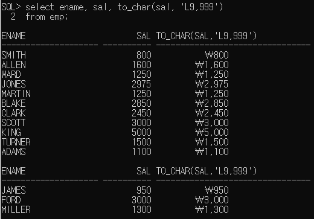

      *날짜를 문자열로 변환 : 년, 월 일 각각의 데이터를 추출하고 싶은 경우

      년도 => YYYY(2019)

      월 =>  MM(12)

      일 => DD(19)

  - 날짜함수

    - sysdate - 오늘날짜(연산이 가능하다)

      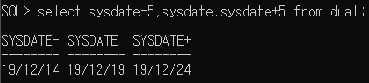

  - null처리 함수

    - nvl(컬럼, null인 경우 처리할 식이나 값) - null경우 대신할 식이나 값을 명시
    - nvl2(컬럼, 표현값1, 표현값2)

    ​                          ㅡㅡㅡ   ㅡㅡㅡㅡ

    ​                          null이     null인 경우

    ​                         아닌경우 

    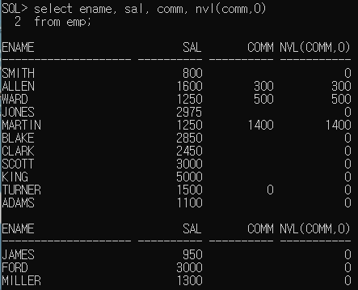

    *언어 변경

    

2)그룹함수

* group by를 적용한 후에 사용할 함수
* sum,avg,max,min,count 등

## 그룹화

​	select 컬럼...

​	from 테이블...

​	where 조건

​	group by 그룹화할 컬럼명(함수를 포함한 식도 가능)

​	having group by한 결과에 적용할 조건

​	order by 정렬할 컬럼명

* 테이블에 저장된 레코드를 그룹화 하여 분류하고 싶은 경우 사용

* select절에는 group by절에 명시한 컬럼명과 그룹함수만

  사용할 수 있다.
  
* 데이터가 복잡한 경우 group by절에 두 개 이상의 컬럼을

  명시할 수 있다.

* group by하기 전에 적용해야 하는 조건은 where절에 정의

* group by한 결과에 조건을 적용해야 하는 경우 having절을 이용

​                                                                                      ㅡㅡㅡㅡㅡ

​                                                                             조건에 그룹함수를 써야 하면 having에 추가

page 설정 : set pagesize 200;

[실습]

부서별 직군의 인원수, 최대급여

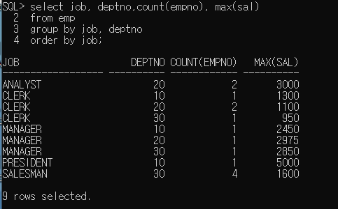

[실습2]
직업별 평균 급여 출력하기
단, 평균급여가 2000이 넘는 데이터만 출력
ename의 마지막 문자가 H인 레코드는 제외하고 작업하기

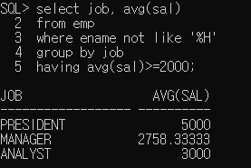

[실습3]

직업별 인원수를 구하기

단, 1983년 입사자는 제외하고 최종 결과로는 인원수가 3명 이상인

직업에 대한 결과 출력하기

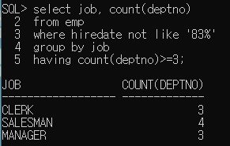

pdf groupby문제

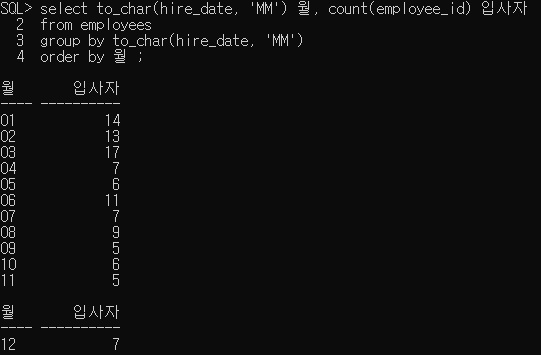

pdf groupby_01 

0번

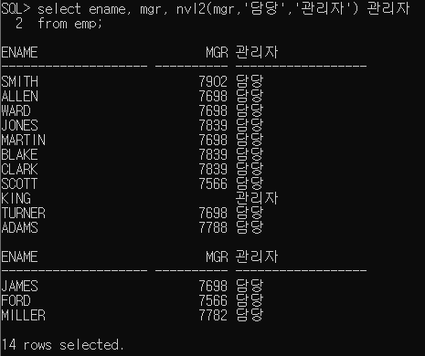

1번

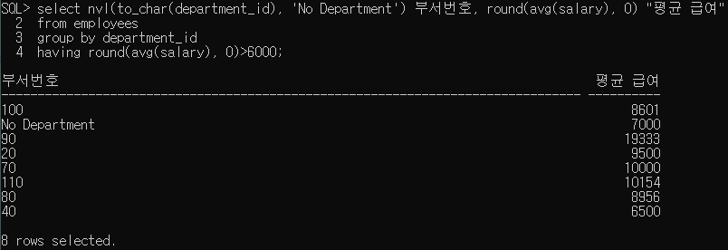

2번

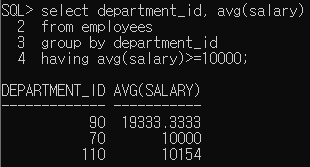

3번

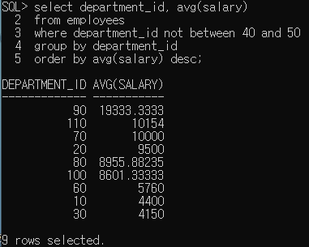

4번

SQL> select first_name, last_name, salary, commission_pct, salary+commission_pct TOTAL
  2  from employees
  3  where commission_pct is not null
  4  order by total desc;

FIRST_NAME                               LAST_NAME                                              SALARY COMMISSION_PCT      TOTAL
---------------------------------------- -------------------------------------------------- ---------- -------------- ----------
John                                     Russell                                                 14000             .4    14000.4
Karen                                    Partners                                                13500             .3    13500.3
Alberto                                  Errazuriz                                               12000             .3    12000.3
Lisa                                     Ozer                                                    11500            .25   11500.25
Gerald                                   Cambrault                                               11000             .3    11000.3
Ellen                                    Abel                                                    11000             .3    11000.3
Clara                                    Vishney                                                 10500            .25   10500.25
Eleni                                    Zlotkey                                                 10500             .2    10500.2
Janette                                  King                                                    10000            .35   10000.35
Peter                                    Tucker                                                  10000             .3    10000.3
Harrison                                 Bloom                                                   10000             .2    10000.2

FIRST_NAME                               LAST_NAME                                              SALARY COMMISSION_PCT      TOTAL
---------------------------------------- -------------------------------------------------- ---------- -------------- ----------
Tayler                                   Fox                                                      9600             .2     9600.2
Patrick                                  Sully                                                    9500            .35    9500.35
David                                    Bernstein                                                9500            .25    9500.25
Danielle                                 Greene                                                   9500            .15    9500.15
Allan                                    McEwen                                                   9000            .35    9000.35
Peter                                    Hall                                                     9000            .25    9000.25
Alyssa                                   Hutton                                                   8800            .25    8800.25
Jonathon                                 Taylor                                                   8600             .2     8600.2
Jack                                     Livingston                                               8400             .2     8400.2
Lindsey                                  Smith                                                    8000             .3     8000.3
Christopher                              Olsen                                                    8000             .2     8000.2

FIRST_NAME                               LAST_NAME                                              SALARY COMMISSION_PCT      TOTAL
---------------------------------------- -------------------------------------------------- ---------- -------------- ----------
Louise                                   Doran                                                    7500             .3     7500.3
Nanette                                  Cambrault                                                7500             .2     7500.2
William                                  Smith                                                    7400            .15    7400.15
Elizabeth                                Bates                                                    7300            .15    7300.15
Mattea                                   Marvins                                                  7200             .1     7200.1
Sarath                                   Sewall                                                   7000            .25    7000.25
Oliver                                   Tuvault                                                  7000            .15    7000.15
Kimberely                                Grant                                                    7000            .15    7000.15
David                                    Lee                                                      6800             .1     6800.1
Sundar                                   Ande                                                     6400             .1     6400.1
Amit                                     Banda                                                    6200             .1     6200.1

FIRST_NAME                               LAST_NAME                                              SALARY COMMISSION_PCT      TOTAL
---------------------------------------- -------------------------------------------------- ---------- -------------- ----------
Charles                                  Johnson                                                  6200             .1     6200.1
Sundita                                  Kumar                                                    6100             .1     6100.1

35 rows selected.