## 조인

#### 1) 조인 기본

- 정규화된 테이블이나 혹은 일반적으로 작성된 여러 테이블의

  컬럼을 이용해서 데이터를 조회하는 것을 조인이라고 한다.

- 조인은 관계형 데이터베이스에 반드시 알아야 하는 개념

- 기본키와 외래키의 관계를 이용해서 테이블을 조인

  외래키를 가지고 기본키 테이블에서 값을 비교하여 작업이 진행된다.

- 조인을 하는 경우 무조건 where절에 조인조건을 정의해야 한다.

- 테이블을 여러 개 사용하는 경우 모든 테이블들의 조인조건을 정의해야

  하며 select절에서 사용하지 않고 조건으로만 사용한다고 하더라도

  조인조건은 정의해야 한다.

[조인방법]

1. from절에 조회하고 싶은 데이터가 저장된 테이블들을 모두 명시

2. 조인을 하는 경우 컬럼이 어떤 테이블의 컬럼인지 명확하게

   정의하기 위해 "테이블명.컬럼명"으로 액세스를 한다.

3. from절에 테이블명을 정의하면서 alias를 함께 추가하여 alias를

   통해 액세스하도록 한다.

   select alias1.컬럼명, alias2.컬럼명 ...

   from 테이블1 alias1, 테이블2 alias2

4. where절에는 반드시 조인조건을 추가하며 조인조건에는

   두 테이블의 값을 비교하기 위해 정의하는 것이므로

   외래키와 기본키를 정의한다.

   외래키테이블(child 테이블)에 정의된 컬럼값을 기본키테이블(parent)에서

   비교하여 정확하게 일치하는 경우 값을 가져온다.

   (테이블이 두 개 -> 조인조건1개, 테이블이 세 개 -> 조인조건2개)

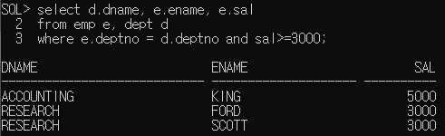

조인조건은 무조건 만족해야하므로 다른 조건추가하면 AND

[실습예제]

부서별 인원수 구하기(단, 부서명으로 출력하기)

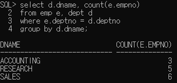

[블로그 예제]

1번

2번

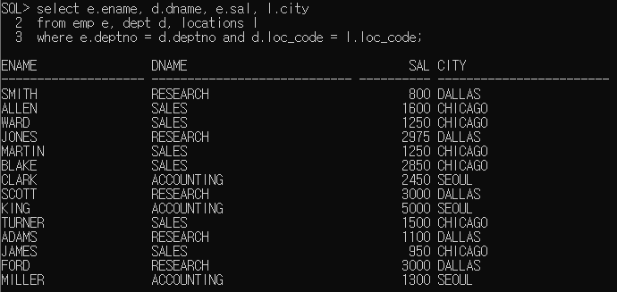

3번

반올림 버림

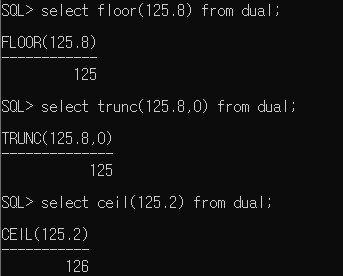

원하는 컬럼만 추가

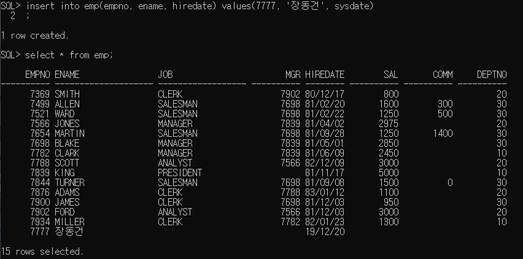

#### 2) 조인 종류

- equi join(inner join) : 두 테이블에서 정확하게 일치하는 컬럼에 대한 데이터만 조인

- outer join : 두 개 이상의 테이블에 조인을 적용했을때 join조건을

  만족하지 않아도 데이터를 조회하고 싶은 경우 사용

  조인조건에 (+)를 추가한다. 

  join조건을 만족하지 않아도 한 쪽 테이블의 모든 데이터를 출력하고

  싶을때 사용하는 조인방식으로 정보가 부족한 테이블의 컬럼에 (+)를 추가한다.

  select 테이블alias.컬럼명....

  from 테이블 alias

  where 테이블alias.컬럼명 = 테이블alias.컬럼명(+)

  or

  where 테이블alias.컬럼명(+) = 테이블alias.컬럼명

  => (+)기호는 한쪽에만 사용한다. 데이터가 확장되어야 하는 곳에 추가한다.

[실습예제]

1. 부서별 인원수를 출력하기

   단, 부서명을 출력하고 인원이 없는 부서명도 모두 출력한다.

   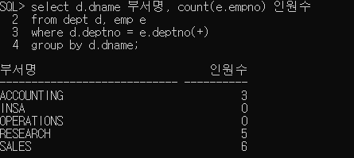

2. 부서별 인원수를 출력하기

   단, 부서명을 출력하고 부서가 배치되지 않은 사원은 "신입사원"으로 표시한다.

   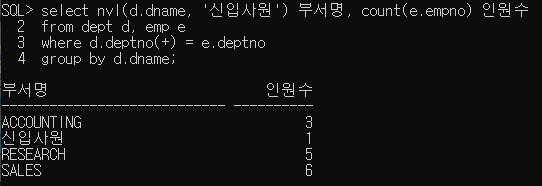

- self조인 : 두 개 이상의 테이블에서 조인하지 않고 같은 테이블의

  컬럼을 이용해서 조인(하나를 가상테이블)

[실습]

관리자별 인원수 구하기

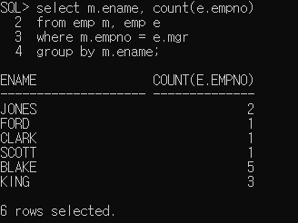

관리자 없는 것까지 출력

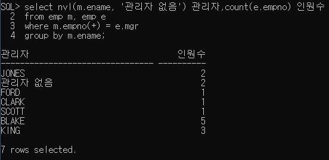

#### view

- 실행결과로 보여주는 가상 테이블

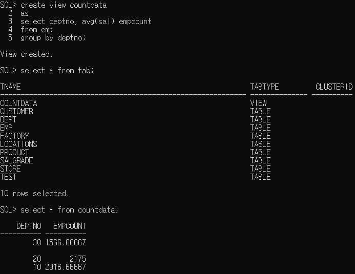

#### 서브쿼리

- SQL문에 삽입된 query

- select문에서 주로 사용하고 select문에 삽입된 select문

  바깥쪽의 query를 main query, 안쪽에 삽입된 query를 sub query라 한다.

- sub query는 괄호로 묶어 주어야 한다.

- sub query 메인쿼리가 실행되기 전에 한 번 실행되며 그 실행결과를

  메인쿼리에서 사용한다.

[실습]

10번 부서의 평균 급여보다 급여를 많이 받는 사원들을 조회

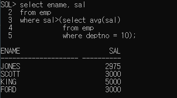

[서브쿼리의 종류]

1) 단일행서브쿼리 - 결과가 1행 1열인 서브쿼리

​	[실습]

​	전체 평균보다 높은 급여를 받는 사원의 목록(ename, sal)

​	

​	smith와 같은 job을 갖고 있는 사원의 목록(ename, job, hiredate)

​	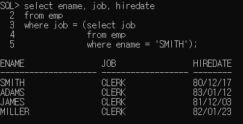

​	

2) 다중행서브쿼리

- 서브쿼리의 실행결과가 열 하나의 행이 여러개 인 경우

- =연산자와 같은 비교연산자를 사용할 수 없다.

- in(열은 하나 행은 여러개), any, all

- <any : 서브쿼리 결과의 최대값보다 작은 값을 구하는 경우

- \>any : 서브쿼리 결과의 최소값보다 큰 값을 구하는 경우

- <all : 서브쿼리 결과의 최소값보다 작은 값을 구하는 경우

- \>all : 서브쿼리 결과의 최대값보다 큰 값을 구하는 경우

  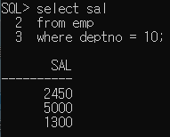

  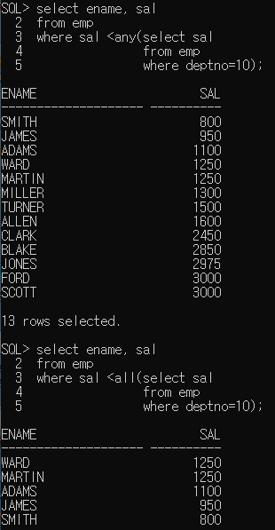

실습

10번 부서의 근무하는 사원들의 job과 같은 job을 갖고 있는 사원의 목록

​	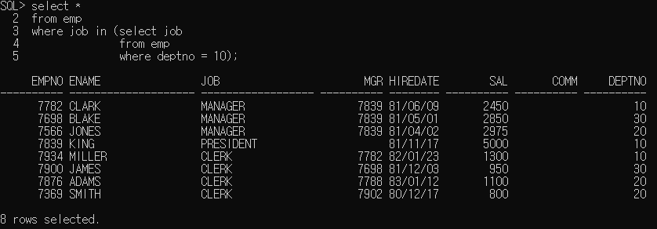

[블로그 예제 1번]

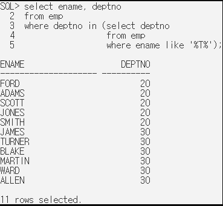

3) 다중컬럼 서브쿼리

- 두개 이상의 컬럼과 다중행을 반환하는 서브쿼리
- 메인쿼리 비교 컬럼의 갯수, 종류가 서브쿼리의 반환 결과와 동일

......

where (컬럼1, 컬럼2) in (select 컬럼1, 컬럼2)

​                                           .........)

[실습]

각 부서별로 최소급여를 받는 사원의 정보를 출력(사원명, 부서코드, 급여, 입사일)

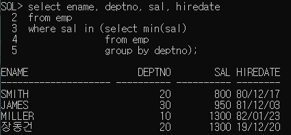

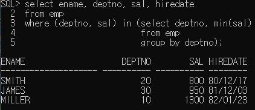

4) 상관형서브쿼리(상호연관서브쿼리)

- 메인쿼리의 값이 서브쿼리에서 사용되는 경우
- 메인쿼리 한 row에 대해 서브쿼리가 한 번씩 실행된다.
- 메인쿼리의 값이 어떤 값이냐에 따라 서브쿼리의 결과가 달라진다.

[실행]

1. 메인쿼리에서 비교할 값을 가져온다.
2. 메인쿼리에서 받은 값을 이용해서 서브쿼리가 실행된다.
3. 서브쿼리의 실행결과로 메인쿼리가 실행된다.
4. 메인쿼리의 레코드수만큼 반복된다.

[실습]

소속부서의 급여 평균보다 급여가 많은 사원들의 정보를 출력(ename, deptno, sal)

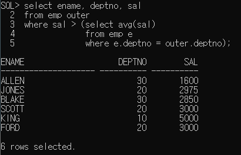

5) from절에서 사용하는 서브쿼리(inline view)

- from절에 서브쿼리를 추가해서 사용

- 서브쿼리 결과를 가상 테이블로 사용하겠다는 의미

- from절에 추가되는 서브쿼리는 alias를 정의해야한다.

- from절에 추가되는 서브쿼리 내부의 컬럼은 실제 컬럼처럼

  메인쿼리에서 사용해야 하므로 컬럼도 컬럼명이 존재하거나

  alias를 정의해야 한다.

  

  select 컬럼명1,.....

  from (select 컬럼......

  ​           from 테이블명

  ​           where......

  ​           group by ....) alias

​	

​	소속부서의 급여 평균보다 급여가 많은 사원들의 정보를 출력

​	=> 조인과 from절에 추가하는 서브쿼리를 이용해서 작업

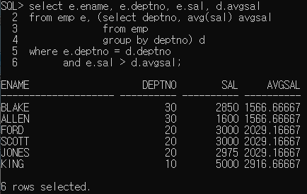

#### 데이터 갱신

insert

한행 

insert into member values('jang','1234','서울');

복수행

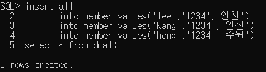

null 추가

insert into member values('jjang',null,null);

복구

rollback;

테이블 삭제

delete member;

delete from member;

행 삭제

delete from member
where id = 'jjang';

delete
from member
where addr = (select addr
              from member
              where id = 'jang')

업데이트

update member
set addr=(select addr
          from member
          where id='jang')
where id='lee';

