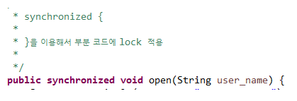

# Thread

## 4/21

Runnable

[실습]

ThreadTest02를 RunnableTest02로 변경

- Runnable을 상속받도록 구현
- AlphaThread -> AlphaThread2
- DigitThread -> DigitThread2

스레드가 공유 객체에 접근해 사용시 다른 스레드의 접근을 막아 주어야함

=> 락을 걸어주어야 한다.

synchronized

[실습]

1. 두 계좌의 잔액을 더하는 쓰레드

   - SharedObj 객체의 계좌잔액을 더해서 sysout으로 출력하는 쓰레드
   - 5번 출력할 수 있도록

2. acc1 계좌에서 acc2 계좌에 100만원씩 이체하는 작업을 수행하는 쓰레드

   - 20번 이체할 수 있도록

     => Account 클래스 활용, sysout으로 정보 출력

   - SharedObj 객체를 이용해서 작업

3. 동기화 하지 않고 테스트

4. 동기화 하고 테스트

메소드를 동기화

public synchronized 리턴타입 메소드명(){

}

코드 블럭을 동기화

synchronized(공유객체){

​	//동기화 시킬 코드를 정의

}