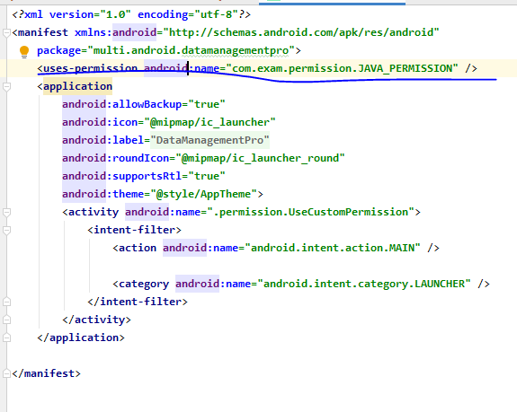

## 3/23

안드로이드 설치

https://developer.android.com/


개발할때 버전을 맞출 수 있다.


-----

## 20-03-24 화

- acitivity_main.xml
- MainActivity.java
- AndoriodManifest.xml : 설명서(권한 등)
- java(genrated) 폴더는 자동생성폴더라 건드리면 X
- res폴더
- 슬래시 기준으로 뒤에 있는게 피일명, 뒤에있는게 폴더명
- @는 참조하고 있다는 뜻
- 폴더에다가 넣는다고 자동인식하는 거이 아니다.
- res폴더에 추가하면 => 리소스를 관리하는 R파일에 내용이 자동으로 저장
- common attribute는 모든 위젯에 공통으로 가지고있는 속성

<< 실습 1 >>

새로운프로젝트 작성( File - New - NewProject )

- App명 : firstPro
- package : exam.day01.first
- 프로젝트명 : firstPro
- 과제 : 화면에 표시된 레이블을 지우고 버튼 세 개를 추가
  - 확인, 취소, 삭제
  - 글꼴 변경
  - avd에 실행해보기

### - MainActivity 실행흐름

1. onCreate ( **최초 한번 실행** )
2. onStart - ( **셋팅이나 자원, 커넥션 등의 작업을 수행** )
3. onResume
4. onPause = > 일시정지 구간
5. onStop = > 일시정지 구간
   1. 다시 2번(onStart)으로.
6. onDestroy

------

## 20-03-25 수

[](https://github.com/kim-svadoz/ksh/blob/master/images/image-20200325093709847.png)

- LinearLayout

- app :

- tools : device에는 적용 X

  => 안드로이드 스튜디오에서만 보여지는 속성

- 썬...?오라클..? 소송...?

### 1. Linear Layout

> 순차적으로 배치(평행, 수직)

- layout_width : view의 너비

  - match_parent :부모의 width size만큼 꽉차게 그리겠다. 폰 size에 꽉차게 레이아웃에 그리겠다.
  - wrap_content : 자기가 갖고 있는 view의 size만큼 꽉차게 그리겠다.

- layout_height : view의높이

- layout_weight : 여백을 해당 view의 사이즈로 포함

  => view가 여러개면 그 view들이 사이즈를 나눠갖겠다!

- layout_gravity : parent내부에서 view의 정렬

- gravity : view내부에서의 정렬

- orientation : 배치 방향

- id : 각 위젯을 식별할 수 있는 이름

  - btn, txt

- margin : 주위 여백

- padding : 내부 컨텐츠와 border사이의 간격

- **layout은 중첩해서 사용이 가능하다.**

  << 실습 >>

  linear_exam01.xml

  linear_exam02.xml

  linear_exam03.xml

### 2. Constraint Layout

> view를 배치하는 것에 제약사항이 있는것

[](https://github.com/kim-svadoz/ksh/blob/master/images/image-20200325135249620.png)

### activity

[](https://github.com/kim-svadoz/ksh/blob/master/images/image-20200325145224853.png)

- 저 두가지 태그가 둘 다 있으면 맨 처음 실행된다.
- 추가로 액티비티를 사용하기 위해서는 Manifest에 등록해줘야 한다.

[](https://github.com/kim-svadoz/ksh/blob/master/images/image-20200325164932889.png)

------

## 20-03-26 목

### 3. Relative Layout

> 상대 레이아웃

- 상대 레이아웃으로 만들 수 있는 화면 레이아웃은 대부분 제약레이아웃으로 만들수 있음.
- 따라서 권장하지않아요~
- 다만 예전에 만든 레이아웃이 '상대'인것이 많기 때문에 알야둬야 한다.

[](https://github.com/kim-svadoz/ksh/blob/master/images/image-20200326094445746.png)

[](https://github.com/kim-svadoz/ksh/blob/master/images/image-20200326101856398.png)

- View : 맨 마지막에 만들어진게 가장 위에 올라온다.
- 모든것들은 제약레이아웃에도 동일하게 적용된다.
- 성능면으로도 제약레이아웃이 더 좋아요.

### 4. Table Layout

> linear layout보다 weight를 주기가 편리하다~

[](https://github.com/kim-svadoz/ksh/blob/master/images/image-20200326101823861.png)

- stretchColumns : 가로방향으로 여유 공간이 있다면 그 여유공간까지 모두 채워서 칼럼을 설정
- 결국은 리니어를 가장 많이 써요~

### 5. Frame Layout

> 여러개의 뷰를 보여주기 위해서 사용

#### 5-1 ImageView_Test

- 안드로이드를하려면 코틀린도 해야한다.
- 화면을 xml로 만든다? => 화면에 변화가 없다.
- 화면에 변화를 주려면 소스코드로 만들어야 해요~

#### 5-2 ScrollView_Test

- ScrollView의 하위는 한 개만 정의해야 한다.

- ScrollView를 추가할 때는 항상 추개햐아함.

  ```
  <ScrollView 
  	android:fillViewport="true">
  ```

### 이벤트처리하기

- 이벤트소스 : 이벤트를 발생시키는 객체( ex.버튼 )
- 이벤트리스너 : 이벤트 발생 시 리스너가 가지고 있는 메소드를 실행

### 익명이너클래스

[](https://github.com/kim-svadoz/ksh/blob/master/images/image-20200327104157675.png)

------

## 20-03-27 금

- drawble_test
- drawble_img_커스터마이징하기

[](https://github.com/kim-svadoz/ksh/blob/master/images/image-20200327093651183.png)

### TextTestActivity

- AppCompat : OS에 맞게 화면으루 맞춰주겟다.

[](https://github.com/kim-svadoz/ksh/blob/master/images/image-20200327101415350.png)

#### - 리소스의 외부화

- [](https://github.com/kim-svadoz/ksh/blob/master/images/image-20200327102415008.png)

[](https://github.com/kim-svadoz/ksh/blob/master/images/image-20200327101810429.png)

[](https://github.com/kim-svadoz/ksh/blob/master/images/image-20200327101830111.png)

#### 이너클래스

#### 외부클래스

## 20-04-06 월

> etc뷰 , 선택위젯, 인텐트(액티비티 -> 액티비티의 전환)(레이아웃 인플레이션)

- 액티비티는 화면.

  - 액티비티A -> 액티비티B를 실행하고싶다?
  - new에서 생성하지 않는다. => 컴포넌트 시스템(안드로이드 내부에서 요청 후 실행)
  - **모든것은 manifest파일을 기반으로 한다!!**

- 현재 안드로이드 버전에서는 캐스팅코드가 필요없다.

- 안드로이드의 매개변수에는 값을 입력 후 자동으로 이름이 출력된다. => 변경하면 안됨

- *이벤트를 붙이는 방법*

  - new View.OnClickListener()를 이용해 직접 onclick메소드를 생성
  - 이벤트를 implements하여 this로 작업
  - 익명이너 클래스로 리스너를 따로 만들어서 이용

- 무조건 리스너를 연결하는 작업을 해줘야함

  => 이벤트연결(위젯이 이벤트에 반응할 수 있도록 연결)

- AppCompat : 어떤 기종이든, 버전이든 최대한 뷰를 맞춰주기 위한코드

- 모든 리소스는 수치화하여 int로 저장된다.

- 안드로의 리소스명은 모두 소문자로 사용해야한다.

### etc_view

> datepicker, calendarview 를 이용해서 스케쥴,일정알림 커스터마이징 가능

### 체크박스

- if/else를 사용하면 불필요하게 코드가 길어진다.
- 자바기반이기때문에 배열 등 자료구조를 이용해서 디자인할 수 있다.

### 라디오박스

### 선택위젯

- 선택위젯과 일반위젯의 차이는 선택위젯은 어댑터 패턴을 사용한다.

### Adapterview ?!

> AdapterView이전의 View들은 따로 디자인하지 않아도 화면에 표시된다.
>
> AdapterView이후의 View들은 따로 코드와 결합해주어야 화면에 표시된다.

#### Adapter 객체

> 리스트 View와 + 리스트뷰에 뿌려질 Data + 어떤식으로 뿌릴지에 대한(Row에 대한) Design
>
> => 이것들을 하나로 mix하는 것이 Adapter 객체이다.
>
> => 마음에 안들것이니 Customizing 해야한다~~

- ListViewTest
- SimpleAdapterTest
- CustomRowTest


xml  안올라 올때

clean project  > rebuid project > build.gradle 두개 > sync하고 재실행


------

## 20-04-07 화

### 레이아웃 인플레이션

> XML레이아웃의 내용이 메모리에 객체화되는 과정

- 패키지 구분하기.

- 레이아웃을 만들때는 항상 context 객체가 들어간다.

- .this 객체를 지정할 때, 익명이너클래스는 객체가 될 수 없기 때문에 아우터클래스.this를 활용하여 아우터클래스를 지칭해줘야 한다.

- 이너클래스에서 아우터클래스의 변수를 접근할 때는 final을 붙여줘야한다.

- **layout Inflator**

  ```
   protected void onCreate(Bundle savedInstanceState) {
          super.onCreate(savedInstanceState);
          setContentView(R.layout.activity_inflator_test);
          Button btn = findViewById(R.id.btnAdd);
          final LinearLayout container = findViewById(R.id.container);
          //레이아웃
          btn.setOnClickListener(new View.OnClickListener() {
              @Override
              public void onClick(View v) {
                  LayoutInflater inflater = 	(LayoutInflater)getSystemService(Context.LAYOUT_INFLATER_SERVICE);
                  inflater.inflate(R.layout.include_view, container, true);
              }
          });
      }
  ```

- 작업을 adapter로 하기 때문에 adapter가 없다면 xml파일의 id를 찾아오지 못하고 => 사용하지 못한다.

### 사용자정의 Adapter 만들기

> 사용자 정의로 디자인한 뷰를 목록으로 사용하고 싶은 경우

- 안드로이드에서 앱을 구성할 때 목록형식을 가장 많이 사용

- 안드로이드 내부에서 제공하는 Adapter로 표현하고 싶은 내용을 모두 표현할 수 없다.

  => 이벤트연결, 각 목록의 구성을 다르게 생성

#### [구성요소]

- Adapter를 이용해서 출력할 데이터를 저장하는 객체 ( ex. DTO )

  - 안드로이드는 getter,setter를 써도되고 안써도 된다. 변수로 접근하는 것이 가능하다.(웹과의 차이점)

- *사용자 정의 Adapter*

  ##### 1) 안드로이드에서 제공하는 Adapter클래스를 상속

  - 리스트뷰를 만들 때 필요한 정보를 저장할 수 있도록 멤버변수 정의

    ```
    정의(Context, row디자인 리소스, 데이터)
    ```

  ##### 2) 생성자 정의

  - 상속받고 있는 ArrayAdapter의 생성자 호출

  ##### 3) ArrayAdapter에 정의되어 있는 메소드를 오버라이딩

  - getView : 리스트뷰의 한 항목이 만들어질 때마다 호출

    => 전달된 리소스를 이용해서 뷰를 생성(LayoutInflator)

    => 한 row를 구성하는 뷰를 찾아서 데이터와 연결

  ##### 4) getView메소드에서 성능개선을 위한 코드를 작성

  - 한번 생성한 view를 재사용
  - findViewById는 한 번만 찾아오기

  ##### 5) ViewHolder라는 객체를 생성

  - row를 구성ㄹ하는 뷰를 한 번 findViewById하기
  - row에 대한 구성 View를 멤버변수로 선언
  - 생성자에서 findViewById처리를 구성
  - 최초로 뷰를 만들 때(row에 대한 뷰) 이 객체를 활용

  ##### 6) row를 구성하는 뷰에 상태값을 저장하기

  - 각 뷰의 이벤트를 통해 저장

  - 각 뷰의 상태값을 저장할 수 있도록 객체를 생성

    => 상태값을 저장한 객체를 자료 구조에 저장

     => focus를 잃어버릴 때 상태를 저장

  ```
  < xml파일 >
  <LinearLayout xmlns:android="http://schemas.android.com/apk/res/android"
      xmlns:app="http://schemas.android.com/apk/res-auto"
      xmlns:tools="http://schemas.android.com/tools"
      android:orientation="vertical"
      android:layout_width="match_parent"
      android:layout_height="match_parent"
      tools:context=".view.activity.CustomAdapterTestActivity">
      <TextView
          android:id="@+id/txtInfo_cust"
          android:layout_width="match_parent"
          android:layout_height="wrap_content"
          android:textAppearance="@style/TextAppearance.AppCompat.Large"
          android:text="Info"/>
      <ListView
          android:id="@+id/cust_listview"
          android:layout_width="match_parent"
          android:layout_height="wrap_content"/>
  
  </LinearLayout>
  ```

  ```
  public class MyAdapter extends ArrayAdapter<User>{
      private Context context;
      private int resId;
      private ArrayList<User> datalist;
  
      public MyAdapter(Context context, int resId, ArrayList<User> datalist) {
          super(context, resId, datalist);
          this.context = context;
          this.resId = resId;
          this.datalist = datalist;
      }
  
      //리스트 갯수를 반환
      @Override
      public int getCount() {
          return datalist.size();
      }
      //매개변수로 전달받은 순서에 있는 리스트 항목을 반환
      @Override
      public User getItem(int position) {
          return datalist.get(position);
      }
      //리스트의 한 항목을 만들 때 호출되는 메소드 - 리스트항목이 100개면 100번 호출
      //position => 리스트 순서
      //convertView => 한 항목에 대한 뷰를 리턴
      @Override
      public View getView(int position, View convertView, ViewGroup parent) {
          Log.d("getview","getview"+position);
          long start = System.nanoTime();
          //View를 생성
          LayoutInflater inflater =
                  (LayoutInflater)context.getSystemService(Context.LAYOUT_INFLATER_SERVICE);
          convertView = inflater.inflate(resId, null);
  
          //ArrayList에서 리턴된 리스트 항목의 번호와 동일한 데이터를 구하기
          User user = datalist.get(position);
  
          //위에서 생성한 뷰의 각 요소에 데이터를 연결
          ImageView imageView = convertView.findViewById(R.id.img);
          TextView nameView = convertView.findViewById(R.id.txtcust1);
          TextView telNumView = convertView.findViewById(R.id.txtcust2);
  
          imageView.setImageResource(user.myImg);
          nameView.setText(user.name);
          telNumView.setText(user.telNum);
  
          long end = System.nanoTime();
          Log.d("getview",(end-start)+"");
  
          return convertView;
      }
  }
  ```

  => getSystemService는 context가 갖고 있는 환경정보이다.

  => 커스터마이징 하는 getView는 액티비티가 아니기 때문에 위에 선언한 context를 이용하여 getSystemService 호출

  ```
  public class CustomAdapterTestActivity extends AppCompatActivity {
  
      @Override
      protected void onCreate(Bundle savedInstanceState) {
          super.onCreate(savedInstanceState);
          setContentView(R.layout.activity_custom_adapter_test);
          TextView info = findViewById(R.id.txtInfo_cust);
          ListView listView = findViewById(R.id.cust_listview);
  
          //1. list에 출력할 데이터
          ArrayList<User> datalist = new ArrayList<User>();
          for(int i=1; i<101; i++){
              User user = new User(R.drawable.ic_launcher_foreground,
                                  "name"+i,
                                  "000000"+i);
              datalist.add(user);
          }
          //2. 사용자정의 어댑터 객체 생성
          MyAdapter adpater = new MyAdapter(this, R.layout.custrow2, datalist);
  
          //3. ListView에 어댑터 연결
          listView.setAdapter(adpater);
      }
  }
  ```

- Adapter를 통해 만들어진 리스트뷰를 보여줄 액티비티

  - main layout필요 !

#### MyAdapt의 성능개선.ver

> 성능 개선을 위한 작업 추가
>
> 1. 한번 만든 뷰는 재사용
> 2. findViewById 한 번 작업한 뷰에 대한 정보는 저장해 놓고 다시 사용

```
public class MyAdapter2 extends ArrayAdapter<User>{
    private Context context;
    private int resId;
    private ArrayList<User> datalist;

    //row마다 사용자가 설정한 값을 position과 함께 저장
    //해당 position에 대한 설정 값을 같이 출력
    //저장하는 시점은 사용자가 설정을 끝낸 시점 - focus를 잃어 버리는 시점
    HashMap<Integer, SaveUserState> saveData = new HashMap<Integer, SaveUserState>();

    public MyAdapter2(Context context, int resId, ArrayList<User> datalist) {
        super(context, resId, datalist);
        this.context = context;
        this.resId = resId;
        this.datalist = datalist;
    }

    //리스트 갯수를 반환
    @Override
    public int getCount() {
        return datalist.size();
    }

    //매개변수로 전달받은 순서에 있는 리스트 항목을 반환
    @Override
    public User getItem(int position) {
        return datalist.get(position);
    }

    //리스트의 한 항목을 만들 때 호출되는 메소드 - 리스트항목이 100개면 100번 호출
    //position => 리스트 순서
    //convertView => 한 항목에 대한 뷰를 리턴
    @Override
    public View getView(final int position, View convertView, ViewGroup parent) {
        Log.d("getview","getview"+position);
        long start = System.nanoTime();
        //View를 생성 - 매개변수로 전달되는 converView를 재사용
        UserViewHolder holder = null;
        if(convertView==null){
            LayoutInflater inflater =
                    (LayoutInflater)context.getSystemService(Context.LAYOUT_INFLATER_SERVICE);
            convertView = inflater.inflate(resId, null);

            //============최초작업이므로 뷰를 찾아서 가져오기=============
            holder = new UserViewHolder(convertView);
            //홀더를 저장
            convertView.setTag(holder);
        }else{
            //=============최초 작업이 아니라 뷰를 재사용하는 중이라면============
            holder = (UserViewHolder)convertView.getTag();
        }

        //ArrayList에서 리턴된 리스트 항목의 번호와 동일한 데이터를 구하기
        User user = datalist.get(position);
        if(user!=null){
            //위에서 생성한 뷰의 각 요소에 데이터를 연결
            ImageView imageView = holder.myImg;
            TextView nameView = holder.nameView;
            TextView telNumView = holder.telNumView;
            final EditText editView = holder.editView;

            imageView.setImageResource(user.myImg);
            nameView.setText(user.name);
            telNumView.setText(user.telNum);

            //뷰를 만들때 저장된 내용이 있는지 체크해서 값을 출력하기
            SaveUserState state = saveData.get(position);
            if(state==null){ // 저장된 객체가 없으면 빈 값을 출력
                editView.setText("");
            }else{ // 저장된 객체가 있음면 객체에서 data를 추출해서 출력
                editView.setText(state.data);
            }

            //EditText가 focus를 잃어버리는 시점에 입력한 데이터를 저장
            editView.setOnFocusChangeListener(new View.OnFocusChangeListener() {
                @Override
                public void onFocusChange(View v, boolean hasFocus) {
                    if(!hasFocus){
                        String data = editView.getText().toString();
                        SaveUserState objstate = new SaveUserState();
                        objstate.data = data;
                        saveData.put(position, objstate);
                    }
                }
            });
        }

        long end = System.nanoTime();
        Log.d("getview",(end-start)+"");
        return convertView;
    }
}
```

#### ExamAdapt

```
public class ExamAdapter extends ArrayAdapter {
    private Context context;
    private int resId;
    private ArrayList<ActorItem> actorlist;

    HashMap<Integer, SaveActorState> saveData = new HashMap<Integer, SaveActorState>();

    public ExamAdapter(Context context, int resId, ArrayList<ActorItem> actorlist) {
        super(context, resId, actorlist);
        this.context = context;
        this.resId = resId;
        this.actorlist = actorlist;
    }

    @Override
    public Object getItem(int position) {
        return super.getItem(position);
    }

    @Override
    public View getView(final int position, View convertView, ViewGroup parent) {

        ViewHolder holder = null;
        if(convertView==null){
            LayoutInflater inflater =
                    (LayoutInflater)context.getSystemService(Context.LAYOUT_INFLATER_SERVICE);
            convertView = inflater.inflate(resId, null);

            //============최초작업이므로 뷰를 찾아서 가져오기=============
            holder = new ViewHolder(convertView);
            //홀더를 저장
            convertView.setTag(holder);
        }else{
            //=============최초 작업이 아니라 뷰를 재사용하는 중이라면============
            holder = (ViewHolder)convertView.getTag();
        }

        ActorItem actor = actorlist.get(position);
        if(actor!=null){
            //위에서 생성한 뷰의 각 요소에 데이터를 연결
            ImageView imageView = holder.myImg;
            TextView nameView = holder.nameView;
            TextView dateView = holder.dateView;
            TextView textView = holder.textView;
            final CheckBox checkView = holder.checkView;

            imageView.setImageResource(actor.myImg);
            nameView.setText(actor.name);
            dateView.setText(actor.date);
            textView.setText(actor.text);

            //뷰를 만들때 저장된 내용이 있는지 체크해서 값을 출력하기
            SaveActorState state = saveData.get(position);
            if(state==null){ // 저장된 객체가 없으면 빈 값을 출력
                checkView.setChecked(false);
            }else{ // 저장된 객체가 있음면 객체에서 data를 추출해서 출력
                checkView.setChecked(state.chkValue);
            }

            checkView.setOnClickListener(new View.OnClickListener() {
                @Override
                public void onClick(View v) {
                    boolean chkValue = checkView.isChecked();
                    SaveActorState chkstate = new SaveActorState();
                    chkstate.chkValue = chkValue;
                    saveData.put(position, chkstate);
                }
            });


        }
        return convertView;
    }
}
```

### 안드로이드 앱의 네 가지 구성요소 (component)?

1. 액티비티(Activity)

   => 화면

2. 서비스(Service)

3. 브로드캐스트 수신자(Broadcast Receiver)

   => 영상통화-배터리량보존되어야함- 이럴때.

   => device에서 일어나는 어떤 사건이 언제일어날지 모를 때 사용

4. 내용 제공자(Content Provider)

   => 화면 공유 , 데이터 공유 가능하게 함

### Intent(인텐트)

> 여러 화면간 전환을 위해 사용 ( 두 가지 방법 존재)

- 실행흐름

  : Activity "A" -> Intent -> 안드로이드OS -> Intent -> Activity "B"


## 4/7

### 사용자 정의 Adapter 만들기

- 안드로이드에서 앱을 구성할때 목록형식을 가장 많이 사용

- 사용자정의로 디자인한 뷰를 목록으로 사용하고 싶은 경우

- 안드로이드 내부에서 제공하는 Adapter로 표현하고 싶은 내용을 

  모두 표현할 수 없다.(이벤트연결, 각 목록의 구성을 다르게 생성...)

### [구성요소]

- Adapter를 이용해서 출력할 데이터를 저장하는 객체(DTO)

- 사용자정의 Adapter

  1) 안드로이드에서 제공하는 Adapter클래스를 상속

  - 리스트뷰를 만들때 필요한 정보를 저장할 수 있도록 멤버변수 정의(Context, row디자인 리소스, 데이터)

  2) 생성자 정의

  - 상속받고 있는 ArrayAdapter의 생성자 호출

  3) ArrayAdapter에 정의되어 있는 메소드를 오버라이딩

  - getView : 리스트뷰의 한 항목이 만들어질때마다 호출

    => 전달된 리소스를 이용해서 뷰르 생성(LayoutInflator)

    => 한 row를 구성하는 뷰를 찾아서 데이터와 연결

  4) getView메소드에서 성능개선을 위한 코드를 작성

  - 한 번 생성한 view를 재사용
  - findViewById는 한 번만 찾아오기

  5) ViewHolder 객체를 생성

  - row를 구성하는 뷰를 한 번 findViewById하기
  - row에 대한 구성 View를 멤버변수로 선언
  - 생성자에서 findViewById처리를 구현
  - 최초로 뷰를 만들때(row에 대한 뷰) 이 객체를 활용

  6) row를 구성하는 뷰에 상태값을 저장하기

  - 각 뷰의 이벤트를 통해 저장

  - 각 뷰의 상태값을 저장할 수 있도록 객체

    : 상태값을 저장한 객체를 자료 구조에 저장

      focus를 잃어버릴때 상태를 저장

- Adapter를 통해 만들어진 리스트뷰를 보여줄 액티비티

  - main layout필요


## 4/8 

### Intent

[기본실행]

1. 인텐트 객체를 생ㅅ어하고 실행할 액티비티의 정보와 데이터를 셋팅

   - 값

     putExtra 메소드를 이용

   - 객체

2. 안드로이드OS에 인텐트객체넘기며 의뢰

   액티비티 실행 startActivity

3. 인텐트에 설정되어 있는 액티비티 호출

4. 호출된 액티비티에서는 안드로이드OS가 넘겨준 인텐트를 가져오기

5. 인텐트에 셋팅된 데이터를 꺼내서 활용


## 4/10

### Permission


앱에 퍼미션 등록


사용하는 쪽에서는 등록한 앱의 퍼미션을 정의해주어야만 접근이 가능




manifest에서 application 밖에 권한 정보 등록하면


접근이 가능


권한에 대한등록을 해주지 않았기 때문


퍼미션 등록


https 통신  권한


권한 관련 앱 만들고 수정시 앱을 삭제 후 다시 실행


카메라 역시 위험권한이므로 설정 안해줄시 앱이 팅김


### Permission 종류

```
일반권한
위험권한
```


위험권한

- 액티비티를 실행하거나 버튼을 누르거나 어떤 기능을 사용할때 권한에 대한 처리를 할 수 있도록 구현


1. 사용메소드

   - checkSelfPermission : 퍼미션의 현재 상태를 확인하는 메소드
     - PERMISSION_DENIED : 퍼미션이 부여되지 않은 상태
     - PERMISSION_GRANTED : 퍼미션이 부여되어 있는 상태

   

   - requestPermissions : checkSelfPermission 메소드의 리턴값이 PERMISSION_DENIED 인 경우 

     권한이 체크되어 있지 않은 경우에 권한을 요청하는 메시지를 표시(이 메소드 이외에도 제공되는 메소드는 여러개)

     

   - onRequestPermissionsResult : requestPermissions 의 결과로 호출되는 메소드

     ​														퍼미션 설정 정보를 매개변수로 넘긴다.

     requestCode : 퍼미션 요청할 때 넘긴 요청코드

     permissions : 요청퍼미션 목록

     grantResults : 퍼미션 설정 성공 결과

     

2. 처리순서

   ​	1) 현재 사용하려고 하는 권한이 설정되어 있는지 체크

   ​		=> checkSelfPermission을 이용

   ​	2) 1번에서 리턴값이 PERMISSION_DENIED 인 경우 사용자가 권한을 설정할 수 있도록 메시지를 표시

   ​		=> requestPermissions

   ​	3) 요청 처리 후 자동으로 호출되는 메소드를 통해 다음에 어떤 처리를 할 것인지 정의

   ​		=> 권한 성공 -> 기능이 실행되도록

   ​			 권한 실패 -> Preference를 통해 설정할 수 있도록 액티비티를 이동하거나 안내 메시지 출력


### 내부 저장소

파일 저장


파일 가져오기


열기 클릭시 "테스트중..." 가져오는 것 확인


---

권한체크는 액티비티


저장버튼을 눌렀을때 

권한이 설정 : Toast("권한설정완료")

권한 설정이 안된 경우 : Toast("권한설정하세요")


외부저장소 저장 위치에 따라 앱을 삭제시 데이터가 삭제되거나 남는다.


Android > data > 패키지명 아래에 데이터를 생성시 앱을 삭제하면 데이터도 삭제된다.

Android 외부에 데이터 생성시 앱을 삭제해도 데이터는 남아있음

