# Deploy to Heroku

---

## 01. 배포 사전 준비

- **필수 확인!!**
    - 프로젝트를 `TIL` 에서 진행하면 절대로 **X**
    - 독립적인 폴더에 프로젝트를 새로 구축해서 진행해야 한다.
    - `git init` 명령어를 통해 해당 폴더를 git 이 독립적으로 관리하는 폴더로 만들어 주어야 한다.

### 1.1. github 레퍼지토리 생성

- `.gitignore` 해당 코드 추가

    ```bash
    # Text backup files
    *.bak

    # Database
    *.sqlite3

    # 환경 설정 관련 파일(뒤에서 설정할 것)
    .env
    ```

- **원격 저장소에 업로드**

    Heroku는 git 형상 관리 시스템과 밀접하게 통합되어있는데, git을 이용하여 활성화된 시스템에 수정 사항의 업로드 및 동기화를 수행한다.

    ```bash
    $ git init
    $ git add .
    $ git commit -m "..."
    $ git remote add origin https://github.com/...
    $ git push origin master
    ```

### 1.2. 환경변수 관리

시크릿 키는 외부에 노출 시키면 안 된다. 보안상의 이슈로 API Key 등은 환경변수로 설정하여 관리한다. `DEBUG` 설정 역시 `True`로 되어있게 되면 내부 코드가 에러 메시지와 함께 드러나기 때문에 의도적인 해킹 공격에 노출될 수 있다.

- **[Decople](https://pypi.org/project/python-decouple/) 라이브러리 활용**
  
    - *Decouple 왜 써요?*
        - Decouple 을 사용하면 환경 변수를 불러오는 `os.getenv` 와 같은 메서드로 서버에서 환경 변수에 접근할 수 있다.
        - Decouple 은 Django 를 위해 설계 되었지만 코드에서 환경 변수 설정을 분리하기 위해 일반적으로 사용하는 툴이 되었다.

    ```bash
    $ pip install python-decouple
    ```

    ```python
    # 프로젝트폴더/.env   ⟸ manage.py 와 같은 위치

    SECRET_KEY='...' # settings.py 에 있는 SECRET_KEY 를 가져온다.
    DEBUG=True # 배포가 성공적으로 되면 다시 False 로 바꾼다.
    ```

    - `KEY=VALUE` 형태로 작성한다.
        - `=` 양옆에 공백 X
        - String 값인 경우 따옴표로 감싼다.

    ```python
    # settings.py

    from decouple import config 

    SECRET_KEY = config('SECRET_KEY') # 기존에 있던 시크릿 Key는 잘래내서 .env에 붙여 넣는다.
    DEBUG = config('DEBUG')
    ```

### 1.3. Serve static files

[Managing static files (e.g. images, JavaScript, CSS) | Django documentation | Django](https://docs.djangoproject.com/en/3.0/howto/static-files/#deployment)

```python
$ python manage.py collectstatic
```

```python
# settings.py

STATIC_ROOT = os.path.join(BASE_DIR, 'staticfiles')
```

```python
# project/urls.py

from django.conf import settings
from django.conf.urls.static import static

urlpatterns += static(settings.STATIC_URL, document_root=settings.STATIC_ROOT)
```

### 1.4. django-heroku

Heroku에서 만든 라이브러리. Django를 heroku에 배포하기 위해 사용한다.

```bash
$ pip install psycopg2==2.7.5
$ pip install django-heroku
```

```python
# settings.py or base.py (최하단)

...

import django_heroku
django_heroku.settings(locals())
```

---

## 02. 배포를 위한 설정

### 2.1. Procfile

웹 어플리케이션을 구동하기 위해 실행되어야 하는 프로세스의 목록이 정의되는 곳이다. 지금 배포하는 django 프로젝트에서는 gunicorn 웹 어플리케이션 서버가 될것이다.

```bash
# Procfile

web: gunicorn [프로젝트_이름].wsgi --log-file -
```


### 2.2. Gunicorn

- **[*Gunicorn*](https://gunicorn.org)**

```bash
$ pip install gunicorn
```

### 2.3. runtime.txt

- 현재 프로젝트가 사용중인 python 버전을 입력한다.
- runtime.txt

    ```bash
    # runtime.txt
    python-3.7.6
    ```

    - `python -V` 명령어로 파이썬 버전 미리 확인한다.

### 2.4. requirements.txt

- Django 를 포함한 파이썬 관련 라이브러리 의존성.
- Heroku 는 환경을 재구성할 때 requirements.txt 에 작성된 패키지들을 자동적으로 설치한다.

    ```bash
    $ pip freeze > requirements.txt
    ```

---

## 03. 배포

### 3.1. Heroku 회원가입 및 CLI 에서 로그인

- **헤로쿠 사이트에서 회원가입 진행.**

    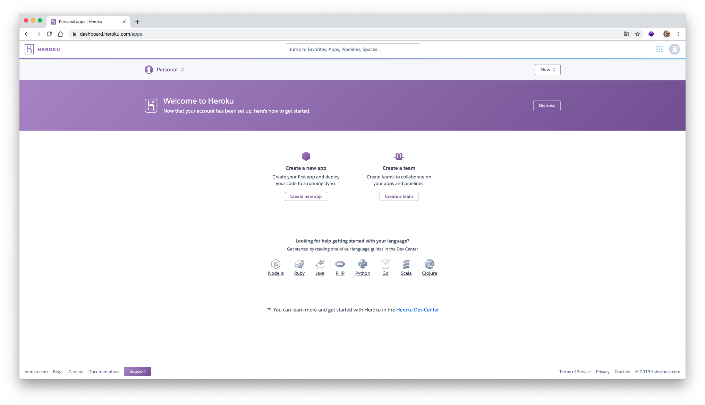

    

- **Heroku cli 윈도우 64 bit 버전 설치**
    - Heroku 에서 heroku cli 검색

        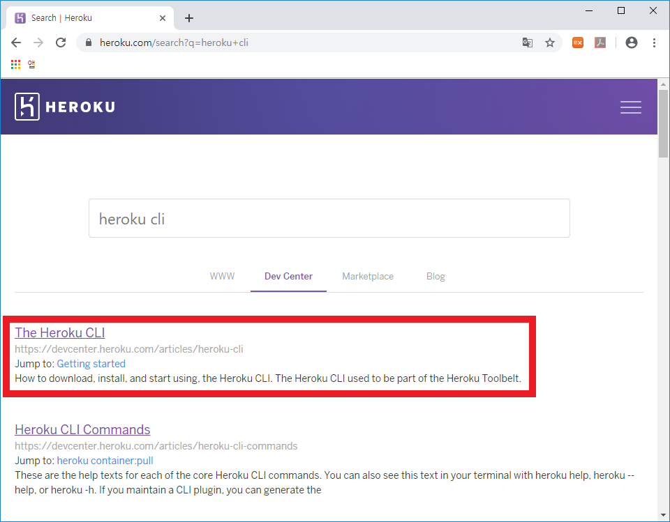

    - 64bit 의 윈도우 버전을 다운로드한다.

        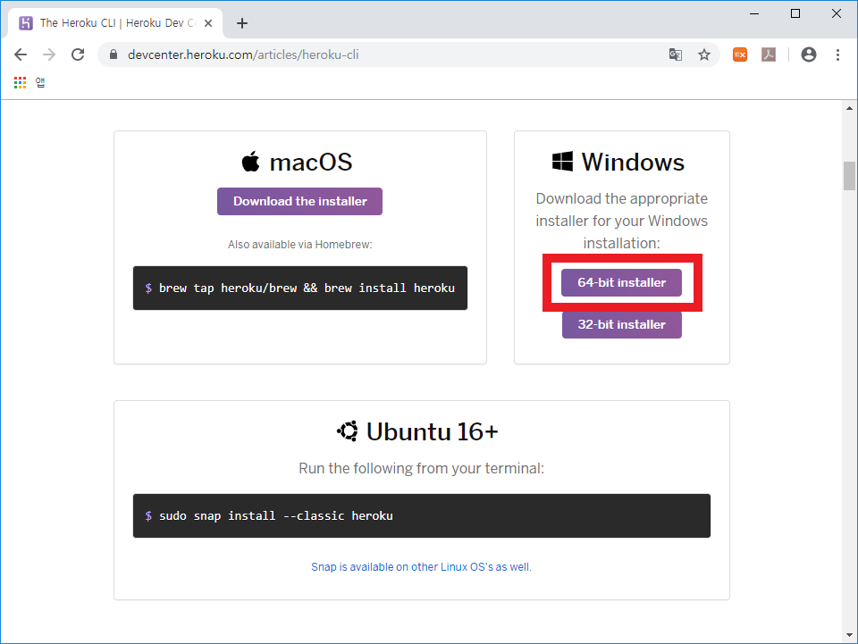

    - 전부 "다음" 을 눌러 설치한다.

        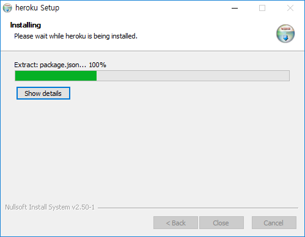

        - 설치가 완료되면 VS Code 를 **완전히 종료 후 다시 시작!**
        
    
- `heroku` 명령어로 사용할 수 있는 명령어 목록 보기

    ```bash
    $ heroku
    ```

    !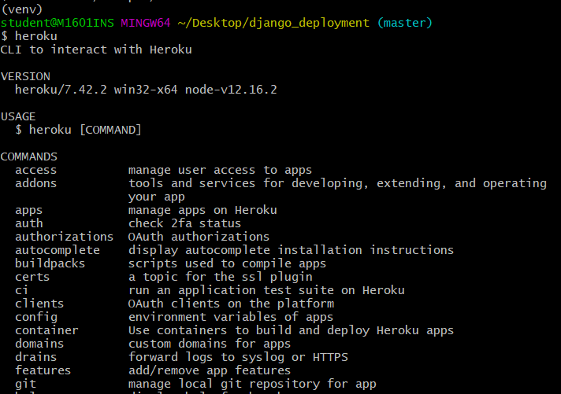

- **cli 로 heroku 에 로그인**

    ```bash
$ heroku login
    ```
    
    - `q` 를 제외한 아무 키나 누르면 브라우저에서 로그인을 할 수 있게 된다.

    **로그인 완료 화면**

    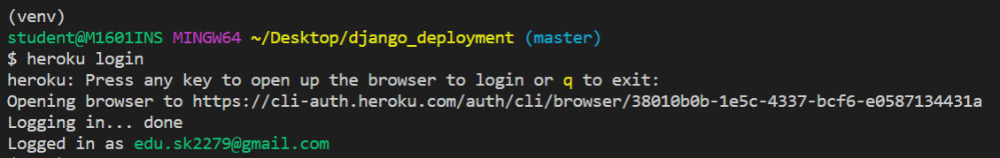

### 3.2. Heroku 에 Django App 배포

- **Heroku app 생성**

    ```bash
    $ heroku create [app_name]
    ```

    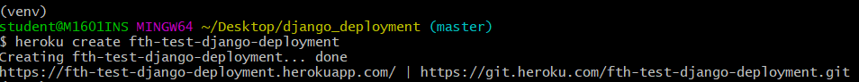

    - app_name 을 입력하지 않을 경우 랜덤으로 만들어 준다.
    - `git remote -v` 해보면 Heroku remote 등록이 된 것을 확인할 수 있다.

        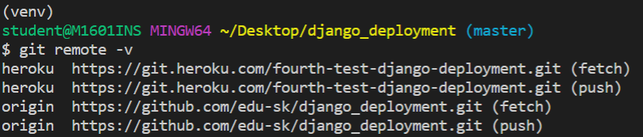

- ALLOWED_HOSTS 등록

    ```python
    ALLOWED_HOSTS = ['fourth-test-django-deployment.herokuapp.com']
    ```

- **Heroku 에 환경변수 등록**

    `.env` 파일은 git 버전관리에서 제외시켰기 때문에 환경변수를 heroku 에 따로 등록한다.

    ```bash
    $ heroku config:set SECRET_KEY='...' # .env 파일에서 복사해온다.
    $ heroku config:set DEBUG=True # 배포 후 정상 작동하면 다시 False 로 변경
    ```

    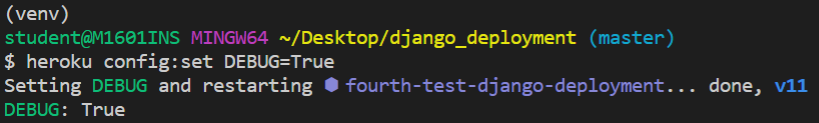

    - `heroku config:set` 이 동작하지 않을 경우 Heroku app에서 settings에서 직접 등록한다.

        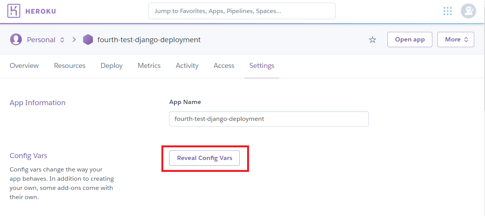

        ---

        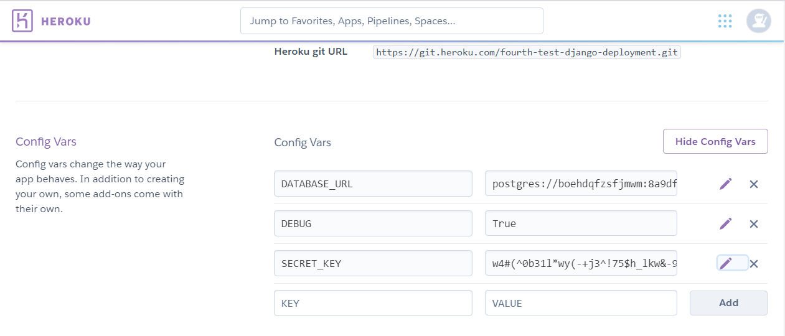

        - Key : SECRET_KEY, DEBUG
        - Value : `' '` 을 제외한 Key 값, False

- **Heroku 에 프로젝트 push**

    - commit

        ```bash
        $ git add . 
        $ git commit -m "commit message" 
        # commit 전에 지금까지 오타 없이 작성했는지 반드시 확인해야 한다.
        ```

    - Heroku 에 push

        ```bash
        $ git push heroku master
        $ heroku config
        ```

        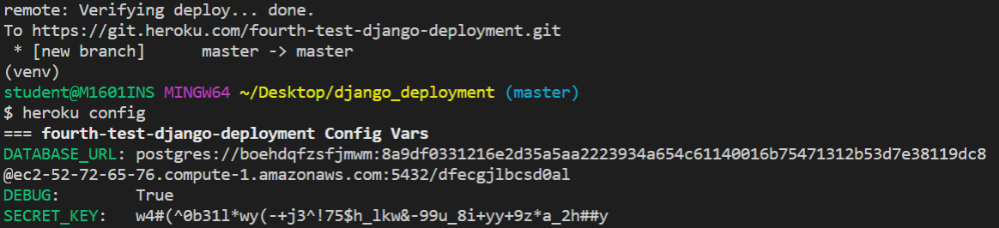

        

### 3.3. 배포한 Django App Initializing

- **Migrate**
    - `ETIMEDOUT` 에러

        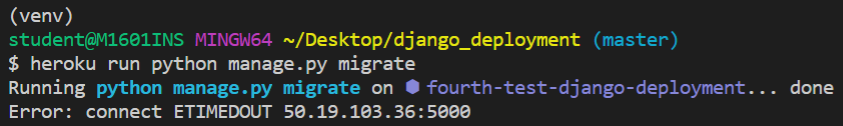

        - 5000 port 가 막혀있어서 발생
        - `heroku run` 으로 시작하는 모든 명령어들을 헤로쿠 웹 콘솔에서 직접 진행해야 한다.

            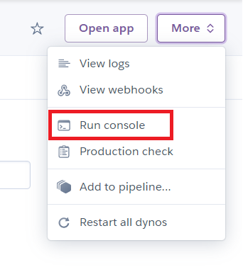$ heroku run python manage.py migrate

    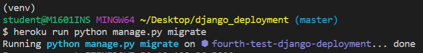
    
- **Admin**

    ```bash
    $ heroku run python manage.py createsuperuser
    ```

    

- **배포 확인**

    ```bash
    $ heroku open
    ```

    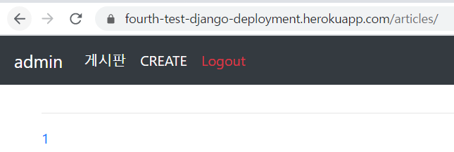

- **DEBUG 모드 전환**

    ```bash
    $ heroku config:set DEBUG=False
    ```

    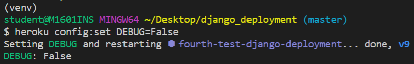

**수정 사항 발생 시**

- **에러 혹은 수정 사항이 생겨 변경을 하면 반드시 아래와 같이 add, commit 이후에 다시 heroku 서버로 push를 진행하고 `heroku open` 을 해야 한다.**
- 에러 해결 후에 아래와 같은 절차 수행

```bash
# 배포에 실패하고 수정 사항이 있으면 수정 이후에 반드시 add, commit 진행

**$ git add .
$ git commit -m "commit message"
$ git push heroku master**
$ heroku open
```
